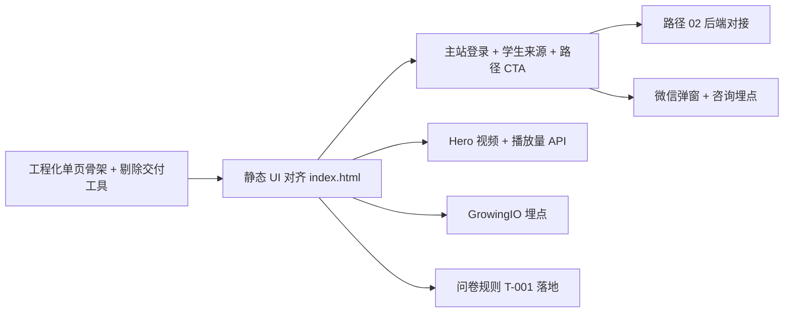

# BC 写作落地页 · 开发交接说明

> **读者**：前端、后端、测试、数据  
> **版本**：开发交付定稿 **v6.5.3**（2026-06-08）  
> **配套文档**：[`BC落地页PRD_6.5.md`](./BC落地页PRD_6.5.md)（完整 PRD）· [`UI/index.html`](./UI/index.html)（UI/交互主参考）· [`BC落地页ToDo.md`](./BC落地页ToDo.md)（阻塞项追踪）· [`README.md`](./README.md)（交付包索引）

---

## 1. 请先读这三条

1. **验收唯一基准**：[`BC落地页PRD_6.5.md`](./BC落地页PRD_6.5.md) + `UI/index.html` + `UI/assets/`。  
   本交付包**不含**历史归档 PRD；勿用项目外旧稿、`BC落地页Demo.html` 或过期 UI 交接做验收。

2. **交付 HTML ≠ 生产代码**：`UI/index.html` 是单文件 React 原型，含 **水滴标注**、**Tweaks 面板**、**模拟登录**。正式工程化实现时须 **剔除** 这些交付工具，并 **复用主站** 登录/视频/SVIP 等能力。

3. **本页在主站隐藏**：用户 **不能** 从 igopx.cn 站内导航链过来；合法入口仅 **WriteUp 深链** 或运营持有的直达 URL（PRD §1.1）。

---

## 2. 交付包与预览

完整目录见 [`README.md`](./README.md)。核心文件：

| 路径 | 用途 |
|------|------|
| `UI/index.html` | 布局、文案常量、交互态、响应式、路径 CTA 目标 URL |
| `UI/assets/` | 静态图（Nav Logo、Hero Banner、**path-banner-01…06**、**会员权益-gpt.jpg**、页脚、学员头像、微信 QR 等） |
| `UI/vendor/` | 本地 React/Babel，**仅预览**；生产替换为工程化方案 |
| `BC落地页PRD_6.5.md` | **开发验收唯一 PRD**（产品 + 设计 + 交互 + 验收 + 埋点） |
| `3Ups_Partner_LandingPage_Tracking_Guide.pdf` | BC GrowingIO 埋点规范（2026-06 更新版） |
| `BC落地页ToDo.md` | 产品/运营/后端仍待补齐项 |

**本地预览**（必须以 `UI/` 为站点根）：

```bash
cd UI && python3 -m http.server 5175
# 打开 http://127.0.0.1:5175/
```

建议视口：**375px · 834px · 1366px · 1820px+**（流程轴仅 ≥1820px 显示）。

---

## 3. 生产构建必须剔除（交付保留）

以下仅存在于交付 `UI/index.html`，**生产环境不得上线**：

| 组件 | 说明 |
|------|------|
| `proto-toolbar` | 左侧蓝/橙水滴开关 |
| `NoteDrip` / `TodoDrip` | PRD/待办标注 |
| `DripModal` | 水滴弹层 |
| Tweaks 面板（右下角 ⚙） | 调试：强调色、模拟登录、手动高亮路径等 |

需求理解阶段可用交付页水滴对照 PRD；**不要把 Tweaks 能力做成产品功能**。

---

## 4. 页面结构（4 区块 IA）

```
导航 Sticky（4 锚点 + 登录/注册）
  ↓
#hero      首屏标语 + 6 集公开课
#pain      需求匹配（默认模式 A 选卡 · 可切模式 B 问卷）
#paths     6 条学习路径 + 推荐高亮 + 路径 02 方案弹窗
#proof     学员故事（3 卡）
页脚       对齐 igopx.cn 主站 Footer
```

宽屏 **≥1820px** 左侧流程轴（4 主步 + 6 路径子项）；&lt;1820px 隐藏，靠顶栏锚点导航。

**代码模块对照**（`UI/index.html`）：

| 区块 | 组件/区域 |
|------|-----------|
| 导航 / 流程轴 | `nav` · `FlowAxis` |
| Hero | `Hero` · `HERO_VIDEOS` |
| 需求匹配 | `PainPointsSection` · `PAIN_POINTS` · 问卷 `PainPointsB` |
| 学习路径 | `ConversionPaths` · `PATHS` · `PATH_CTA_TARGETS` · `PathCard` |
| 路径 02 | `Path02PlanProvider` · 上传/生成/结果弹窗 |
| 学员故事 | `Proof` · `TESTIMONIALS` |
| 登录 | `AuthProvider` · `LoginRegisterModal` · `SvipIntroModal` |
| 微信咨询 | `WeChatConsultModal` |

---

## 5. 开发重点（按优先级）

### 5.1 路径 CTA 与登录拦截（P0）

交付页常量 **`PATH_CTA_TARGETS`** 已写死，正式版应配置化或环境变量管理：

| 路径 | 行为 | 目标 |
|------|------|------|
| 01 | 登录后跳转 | `https://www.igopx.cn/course/713?nav=13&name=课程广场&url=/courseSquare?nav=13` |
| 02 | 登录后开 **内嵌弹窗** | AI 方案流程（§5.1），**非外链** |
| 03 | 登录后跳转 | `https://www.igopx.cn/courses?nav=1` |
| 04 | **直接开微信咨询弹窗** | **不拦截登录**，与「扫码咨询」卡同弹窗 |
| 05 | 登录后跳转 | `https://www.igopx.cn/myaIPlan` |
| 06 | 登录后跳转 | `https://www.igopx.cn/course/714?nav=13&name=课程广场&url=/courseSquare?nav=13` |

**注意**：
- 路径 **04 是唯一例外**：主 CTA 不走路径登录拦截，直接 `WeChatConsultModal`。
- 其余路径 01/02/03/05/06：未登录 → 先出 **登录/注册网关弹窗**（交付页为模拟）；网关内 **「登录」→ 主站登录窗口**、**「注册」→ 主站注册窗口**；权益文案 **「SVIP」→ 主站会员权益长图弹窗**。
- 登录成功后须 **恢复原意图**（02 开弹窗，01/03/05/06 跳转）。
- **导航 Logo URL 仍待产品提供**（T-002）。

### 5.2 注册来源与 SVIP（P0 · 后端 + 主站账号）

本页 **新用户注册** 时：

| 项 | 规则 |
|----|------|
| 用户表字段 | **学生来源** = **`BC落地页`**（主站枚举须新增） |
| 写入时机 | 注册成功创建用户时一次性写入 |
| 老用户登录 | **不覆盖** 既有来源 |
| SVIP 赠礼 | 仅 `学生来源 = BC落地页` 的新注册用户自动送 **7 天 SVIP**（￥99） |
| 前端 | 打开登录/注册时携带来源参数（与主站约定 `source` / `landing_id` / utm） |

交付页 `AuthProvider` **点击即模拟已登录**；正式版网关内 **「登录」「注册」须唤起主站对应窗口**，**不得**仅本地 `completeAuth` 模拟。

### 5.3 路径 02 · AI 学习方案（P0 · 后端阻塞 T-012/T-013）

交付页为 **Demo 模拟**（localStorage + 定时器），正式能力依赖后端：

- 登录后上传 **1–2 个 PDF**（≤5MB）→ **异步任务**（≤1 分钟目标）
- 等待中 **可关弹窗**，任务继续；**当前会话内**完成后自动弹结果
- 再次进入 **不自动弹**；路径卡展示「查看我的方案」
- 已有方案再生成 → **覆盖确认**；生成中点 CTA → toast 拦截
- 账号绑定；服务端保留最近 **3 份**历史；用户侧仅 **1 份当前有效**
- 上传区：**满 2 份隐藏上传区**，删除后重现

教研须交付方案模版（T-012）；后端须实现上传/任务/PDF 导出（T-013）。

### 5.3.1 6.8 补充素材（图片）

正式素材见 [`BC落地页6.8补充/素材落位说明.md`](./BC落地页6.8补充/素材落位说明.md)：路径 Banner、分路径微信二维码（01/06 销售码，其余运营码）、SVIP 权益长图。复制到 `UI/assets/` 后生效。

### 5.4 BC GrowingIO 埋点（P0 · 合规 · T-010/T-011）

**开发文档**：[`BC埋点开发说明.md`](./BC埋点开发说明.md)（实现细节、联调清单、自测用例）

- 强制 **GrowingIO Web JS SDK 4.x**
- 全页一次 `gdp('setUserId', ut)` + `gdp('track', 'tracker_btn_click', { btn_id: 'set_user_id' })`（BC 引流 `ut` 参数）
- 转化统一 `gdp('track', 'tracker_btn_click', { btn_id })`
- **BC 验收 3 指标（已定）**：① SDK 自动 **PV + UV**；② 仅 6 路径主 CTA → `path_cta_01`…`06`；③ 本页弹窗内新注册 → `register_success`（跳转主站后注册不算）
- 产品口径见 PRD **§4.3.1**；须与 BC（杨效鲁）联调验收
- SDK 凭证（Account ID / Data Source ID）待 BC 提供（T-010）

### 5.5 Hero 视频与播放量（P1）

**已定**：
- 6 集标题/小标题/讲师 **Icey Zhang**（`HERO_VIDEOS`）
- 无需登录观看；**不做**自动连播
- 播放量：展示 = 真实 + round(预设×随机×时间)，规则见 PRD §4.2（T-004/T-005 已定）

**仍待运营**（T-003b）：各集真实时长、封面、播放地址、主题角标。

### 5.6 需求匹配 / 问卷（P1 · 产品阻塞 T-001）

- 默认 **模式 A**（6 痛点卡单选）；「互动诊断」入口必须明显
- 模式 A/B **互斥**；匹配后 `matchHookIdx` → 路径索引 + 详情 **paper-2 高亮**
- 模式 B 计票逻辑：交付页现有实现可供联调；**正式规则与平局策略待 T-001**

### 5.7 微信咨询（P1）

- 6 路径共用 **同一二维码** 素材（Demo `wechat-consult-qr.png`；正式版见 **T-016**）
- 卡片 + 路径 04 主 CTA 均打开同一弹窗（联名 Logo + 二维码 +「长按识别二维码」）
- 埋点建议：`path_wechat_consult`（T-011）

### 5.8 响应式与动效（P1）

- 三档断点：Mobile &lt;768 · Tablet 768–1023 · Desktop ≥1024；流程轴 ≥1820
- Hero Desktop ≥1366px 使用 Figma Banner 精确坐标
- 播放按钮点击：**不得位移**（ripple/scale 仅视觉层）
- 尊重 `prefers-reduced-motion`：锚点/路径跳转用瞬时而非平滑滚动

---

## 6. 交付页与正式版差异（勿照搬）

| 能力 | 交付页 Demo | 正式版 |
|------|-------------|--------|
| 登录/注册 | 点击即 `localStorage` 模拟 | **复用主站账号组件** |
| 路径 02 方案 | 本地存储 + 12s 模拟生成 | 真实上传 + 异步 API |
| 视频播放 | 占位图 + 静态元数据 | 真实播放器 + CDN 地址 |
| 播放量 | 前端写死展示数 | 后端 hourly 聚合 + 去重 |
| 路径高亮 | Tweaks 可手动指定 | 仅用户匹配触发 |
| 路径媒体图 | 6 路径共用 1 张占位图 | 各路径 1 张 16:10 正式图（**T-016**） |
| 微信 QR | Demo 占位 PNG | 正式咨询二维码（**T-016**） |
| 水滴 / Tweaks | 保留 | **删除** |

---

## 7. 阻塞项清单（开发前须对齐负责人）

| ID | 事项 | 负责人 | 影响 |
|----|------|--------|------|
| **T-001** | 问卷正式规则 + 平局策略 + 验算用例 | 产品 | 模式 B 验收 |
| **T-002** | 导航 **Logo** 点击 URL | 产品/运营 | 导航回流 |
| **T-003b** | 6 集视频时长/封面/播放地址 | 内容/运营 | Hero 真实播放 |
| **T-006** | 主站登录组件对接 + 学生来源落库联调 | 前端/后端 | 全路径转化 |
| **T-008** | 正式品牌素材替换（Demo 已接 Figma） | 设计/品牌 | Nav/视觉 |
| **T-010** | GrowingIO 凭证 | BC | SDK 初始化 |
| **T-011** | btn_id 联调验收 | 前端/BC | 埋点上线 |
| **T-012** | 路径 02 AI 方案模版 | 产品/教研 | 方案内容 |
| **T-013** | 路径 02 后端（上传/任务/PDF） | 后端 | 路径 02 正式能力 |
| **T-015** | 产品侧内部分析埋点（§4.3.2） | 前端/数据 | 与 BC 埋点并行 |
| **T-016** | 6 条路径媒体图 + 微信咨询二维码 | 设计/运营 | Demo 已占位 `path-banner-01`…`06`；**正式终稿仍待替换** |

路径 CTA URL（01/03/04/05/06）与路径 02 文案（T-014）**已定**，见 PRD §2.2 功能 5。

---

## 8. 交叉校验结论（v6.5.3 · 2026-06-08）

本次审计已确认 **PRD ↔ `UI/index.html` 一致** 的要点：

| 检查项 | 状态 |
|--------|------|
| 6 路径 `PATHS[]` 文案 / CTA / hookIdx | ✅ 与 PRD 表一致 |
| `PATH_BANNER_SRC` → `path-banner-01`…`06` 按索引 | ✅ Demo 媒体已接入 |
| SVIP 弹窗 Demo → `会员权益-gpt.jpg` 长图 | ✅ 与 PRD §2.2 一致 |
| `DOC_LINKS.prd` → `../BC落地页PRD_6.5.md` | ✅ 交付包路径正确 |
| `PATH_CTA_TARGETS` 跳转 URL | ✅ 与 PRD §2.2 功能 5 表一致 |
| 路径 04 主 CTA → 微信弹窗、不登录拦截 | ✅ 代码 + PRD 一致 |
| `TESTIMONIALS` 三例数据 | ✅ 与 PRD 功能 6 表一致 |
| `HERO_VIDEOS` 6 集标题 + 讲师 Icey Zhang | ✅ 一致 |
| `PAIN_POINTS` hookIdx 0–5 ↔ 6 路径 | ✅ 一一对应 |
| 学员故事 / 路径标题 / 微信弹窗文案 | ✅ 一致 |
| 主站隐藏 / 学生来源 BC落地页 | ✅ PRD §1.1 / §2.2 已写 |
| 生产剔除水滴/Tweaks | ✅ PRD §2.3 已声明 |

**v6.5.3 变更摘要**：
- 路径媒体：每条路径独立 `path-banner-XX.png`（路径 05 主标题 **AI个性化学习日历**）
- SVIP 弹窗：文字列表 → `会员权益-gpt.jpg` 纵向长图占位
- 路径媒体区 `DripAnchor` 布局修复（16:10 不再渲染为 0 宽）
- 水滴 `DOC_LINKS` 指向交付包内 `BC落地页PRD_6.5.md`

**历史修正（v6.5.1）**：
- PRD 去除 §1.1 重复标题
- PRD 验收标准：路径 04 不触发登录拦截（与代码一致）
- 播放量水滴 `prd` 引用修正为 §2.2 功能 1.2

---

## 9. 建议开发顺序



1. 搭工程骨架，**先删** 水滴/Tweaks，再迁 UI  
2. 静态页 + 响应式 + 文案常量与 `PATHS` / `HERO_VIDEOS` 对齐  
3. 对接主站登录 + 路径 CTA 跳转 + 学生来源  
4. 并行：路径 02 API、BC 埋点、Hero 视频资源  
5. T-001 规则到位后补全问卷验收用例  

---

## 10. 联系人 / 参考

| 事项 | 参考 |
|------|------|
| 完整需求 | [`BC落地页PRD_6.5.md`](./BC落地页PRD_6.5.md) |
| 待办追踪 | [`BC落地页ToDo.md`](./BC落地页ToDo.md) |
| BC 埋点对接 | Yang.Xiaolu@britishcouncil.org.cn · PRD §4.3.1 · [`3Ups_Partner_LandingPage_Tracking_Guide.pdf`](./3Ups_Partner_LandingPage_Tracking_Guide.pdf) |

有问题先查 PRD 对应 § 的 **Given/When/Then** 验收标准；仍不明确则按 `BC落地页ToDo.md` 找负责人。
