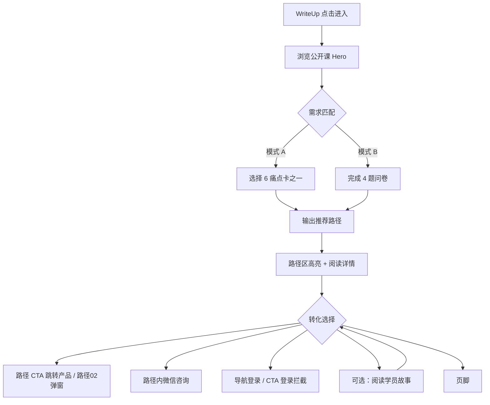

# 产品需求文档：IELTS Writing 落地页（BC WriteUp 引流）· 正式交付版

**模块ID**: M1（单页产品，整体作为一个模块）  
**需求分支**: `bc-ielts-writing-landing`（待正式建档）  
**优先级**: P1  
**创建时间**: 2026-05-28  
**状态**: **正式交付稿 v1.0.17**（与 [`UI/index.html`](../index.html) 对齐；开发冻结版见 [`BC落地页PRD_6.5.md`](../../BC落地页PRD_6.5.md)）  
**历史文档**: [`PRODUCT.md`](./PRODUCT.md)、[`DESIGN.md`](./DESIGN.md) 已合并入本文，勿再单独维护  
**归档参考**: 项目根目录 [`BC落地页PRD.md`](../../BC落地页PRD.md)（v0.21 Demo 交付稿，仅作对照）  
**待办清单**: [`BC落地页ToDo.md`](../../BC落地页ToDo.md)  
**BC 埋点指南**: [`Partner_LandingPage_Tracking_Guide.pdf`](./Partner_LandingPage_Tracking_Guide.pdf)

> **开发约定**：正式实现以 **本文 + `UI/index.html` + `UI/assets/`** 为唯一 UI/交互来源；`BC落地页Demo.html` 与根目录主 PRD 不再作为验收基准。

---

## 0. 交付说明（UI / 开发 / 测试）

### 0.1 交付包清单

| 文件 / 目录 | 用途 | 读者 |
|-------------|------|------|
| **[`UI/index.html`](../index.html)** | UI 交付页（React 单文件 + 内联样式）；布局、交互态、响应式、文案常量 | 前端（主参考） |
| **[`UI/assets/`](../assets/)** | 正式静态图（Nav/Hero Banner/页脚/路径占位/学员头像等） | 前端 |
| **[`UI/vendor/`](../vendor/)** | 本地 React/Babel（预览用）；生产构建可替换为工程化方案 | 前端 |
| **本文档** | 产品 + 设计 + 交互 + 验收 + 埋点的**唯一需求来源**（工作稿） | 全员 |
| [`BC落地页PRD_6.5.md`](../../BC落地页PRD_6.5.md) | **开发交付冻结版**（立项以本文为准） | 开发、测试 |
| [`BC落地页-开发交接.md`](../../BC落地页-开发交接.md) | 开发必读：重点、阻塞项、Demo/正式差异 | 开发 |
| [`BC落地页-UI交接.md`](./BC落地页-UI交接.md) | UI 快速自检摘要 | UI、前端 |
| [`Partner_LandingPage_Tracking_Guide.pdf`](./Partner_LandingPage_Tracking_Guide.pdf) | BC 强制 GrowingIO 规范 | 前端、数据 |

### 0.2 如何预览 UI 交付页

1. 在 `UI/` 目录启动静态服务，例如：`python3 -m http.server 5175`  
2. 浏览器打开 `http://127.0.0.1:5175/`（须以 `UI/` 为站点根，否则资源路径错误）  
3. 建议视口：**375px（Mobile）· 834px（Tablet）· 1366px（Desktop Banner）· 1820px+（流程轴）**  
4. 交付 HTML **保留**左侧「原型标注」控制条（可开关蓝/橙水滴）与右下角 Tweaks；**仅供开发/测试对照 PRD**，生产构建须剔除（见 §2.3）

### 0.3 开发模块对照

| 模块 | PRD 章节 | `UI/index.html` 参考 |
|------|----------|------------------------|
| IA / 导航 / 流程轴 | §2.1 | `nav` · `FlowAxis` |
| Hero 标语 + 视频 | §2.2 功能 1 | `Hero` · `.hero-tagline` · `.hero-showcase` |
| 需求匹配 A/B | §2.2 功能 2–4 | `PainPointsSection` · `PainPointsA` / `PainPointsB` |
| 6 路径 + 登录拦截 | §2.2 功能 5 | `ConversionPaths` · `PathCard` · `#path-0`…`#path-5` |
| 路径 02 AI 方案 | §2.2 功能 5.1 | `Path02PlanProvider` · 弹窗系列 |
| 学员故事 | §2.2 功能 6 | `Proof` · `#proof` |
| 页脚 | §2.2 功能 7 | `Footer` · `.site-footer` |
| 埋点 | §4.3 | 事件名见字典；SDK 凭证 T-010 |

**生产环境必须剔除**（交付 HTML 可保留）：Tweaks 面板、备注/待办水滴、`proto-toolbar` 及关联脚本（§2.3）。开发阶段请用控制条开关理解需求，勿依赖其作为产品功能。

### 0.4 测试验收入口

- 功能验收：§6.2 清单 + 各功能 **Given/When/Then**  
- 匹配逻辑：§10（正式规则以 T-001 为准）  
- 交付前自检：§9.6

---

## 1. 产品概述

### 1.0 产品定位与设计原则（合并自 PRODUCT.md）

**产品目的**：单页落地页，将 British Council WriteUp 流量导入躺着学雅思写作生态；链路为「公开课建立信任 → 需求识别（选卡/问卷）→ 六条学习路径推荐 → 学员故事 → 路径 CTA / 微信 / 登录注册 / SVIP 体验」。

**品牌气质**：专业、共情、有结构感——像能诊断瓶颈、讲清选项、给出可执行下一步的写作教练。情感目标：**被理解、被匹配、有动力**。

**设计原则**：
- **先证明再说服**：真实公开课、讲师、数据与路径细节优先于空泛销售话术  
- **让学习者感到被识别**：痛点卡、问卷、高亮路径、CTA 对应可识别的雅思写作状态  
- **路线可见**：Sticky 导航、宽屏流程轴、路径索引、锚点跳转支撑长页阅读  
- **六条路径边界清晰**：每条对应独立学习状态、利益点、CTA 与咨询入口  
- **联名信任**：BC WriteUp 来源与躺着学目的地同时可见，页脚不重复 BC Logo  

**应避免（反模式）**：
- 泛教育销售页、纯 brochure、深色科技仪表盘、英文装饰标签的国际学校风  
- 与页面区块 **01–06** 冲突的页面级大序号、底部「免费试学」独立转化区；**生产环境**不得出现原型水滴/Tweaks（交付 HTML 可保留，见 §2.3）  
- 弱化「互动诊断」入口、页脚重复 BC Logo、痛点卡角标箭头 / 独立「已匹配」横条（已废弃）

**无障碍与包容**：中文优先；Mobile/Tablet/Desktop/宽屏完整可用；对比度建议 WCAG AA；`prefers-reduced-motion` 下减弱 ripple、进度、选卡过渡；流程轴 **&lt;1820px 隐藏**，不遮挡正文。

### 1.1 产品目标

本页面是**英国文化协会（British Council）WriteUp 网站**向**躺着学**平台引流的专用落地页，聚焦 **IELTS Writing（雅思写作）** 单科/单能力场景。页面在 WriteUp 与躺着学主站之间承担「承接 → 诊断 → 推荐 → 转化」的桥梁角色。

学生从 WriteUp 进入后，应能在较短时间内感受到：  
1）平台对雅思写作问题有专业理解；  
2）自己的学习诉求被「看见」并匹配到对应方案；  
3）存在清晰、可信的下一步行动（课程、计划、训练营、精批、私域咨询等）。

**核心价值**：用「公开课建立信任 + 需求匹配建立相关性 + 路径展示建立解决方案感 + 社会证明降低决策成本 + 路径 CTA / 私域咨询完成转化」，将 WriteUp 流量高效导向躺着学写作相关产品与私域。

**页面入口与主站可见性（已定）**：

| 项 | 规则 |
|----|------|
| 定位 | **BC WriteUp 渠道专用落地页**，非主站常规栏目页 |
| 主站可见性 | 在 **躺着学主站（igopx.cn）隐藏**：不出现在顶栏/底栏/站内导航、首页模块、产品列表、sitemap 等任何可发现入口 |
| 站内链入 | **主站各页面不得链接至本页**（含 Logo 回流、Banner、活动位、页脚、站内搜索推荐等）；用户 **无法从主站「链过来」** |
| 合法入口 | **仅** WriteUp 侧外链/深链（可带 UTM/`ut`）及运营/测试持有的 **直达 URL** |
| 出站转化 | 本页 CTA 可跳转主站产品页（T-002）；导航 Logo 点击目标见 T-002，**默认回流主站首页或约定页，非本落地页互链** |

### 1.2 目标用户

| 用户角色 | 描述 | 核心需求 |
|----------|------|----------|
| WriteUp 引流访客 | 已在 BC WriteUp 接触写作内容，对「提分/系统学习」有初步兴趣 | 快速判断「这家机构懂不懂我的问题」「有没有适合我的方案」 |
| 卡分型考生 | 写作长期 5.5–6.5，练过模板/题库但分数不动 | 找到瓶颈（论证/语言/结构）并获得可执行训练路径 |
| 规划型考生（J 人） | 有明确目标分和考试日期，希望日程可执行 | 获得倒排到考试日的学习计划 |
| 自学型考生（I 人） | 偏好录播+自主节奏，不愿跟大班 | 高质量录播/互动课，可自控进度 |
| 社交型考生（E 人） | 需要同伴监督、打卡、互评 | 训练营/社群陪伴式学习 |
| 诊断型考生 | 希望老师 pinpoint 失分点 | 人工精批 + 讲解 + 答疑 |
| 决策观望者 | 尚未决定付费，需要先体验 | 路径 CTA、7 天 SVIP 注册权益、顾问咨询 |

### 1.3 使用场景

#### 场景 1：WriteUp 深链进入，快速建立专业感

**触发条件**：用户从 WriteUp 写作相关内容点击跳转至本落地页（可能携带 UTM/来源参数）。

**用户操作流程**：
1. 用户进入页面，首屏看到写作公开课视频与播放列表  
2. 浏览/播放 1 条精选公开课，感知师资与内容质量  
3. 通过导航或滚动进入「需求匹配」区块  

**价值**：用真实课堂内容而非纯销售话术建立「专业可信」的第一印象。

#### 场景 2：完成需求匹配，获得个性化路径推荐

**触发条件**：用户对「哪种学习方式适合我」不确定，或希望页面只展示相关内容。

**用户操作流程**：
1. 用户进入「问题匹配」区，**默认看到 6 张痛点卡（模式 A · 自主选择）**；若不确定，可通过 **「互动诊断」** 按钮或右侧引导进入 **模式 B（4 题问卷）**  
2. 完成选卡或作答  
3. 系统给出匹配的「学习路径类型」，并在下方 6 条路径中高亮推荐项  
4. 用户在**已选中的痛点卡**右下角点击「查看路径」，**平滑滚动**至对应路径详情（`#path-{hookIdx}`）  

**价值**：让用户产生「被理解、被定制」的感受，降低信息过载，提高后续 CTA 点击率。

#### 场景 3：浏览推荐路径并完成转化

**触发条件**：用户已完成匹配，或自行浏览路径索引。

**用户操作流程**：
1. 用户阅读被高亮推荐的路径详情（标题、卖点、要点、CTA）  
2. 可选：扫码添加写作顾问微信咨询  
3. 点击路径 CTA 进入主站产品页 / 内嵌弹窗（路径 02）/ 私域 / 注册流程  

**价值**：将兴趣转化为具体行动（咨询、购买、加私域、获取 AI 方案）。

---

## 2. 功能需求

### 2.1 页面信息架构（IA）

页面为**单页长滚动**结构，锚点导航如下：

| 区块 ID | 导航名称 | 区块一级标题（页面内） | 二级标题（slogan） | 职责 |
|---------|----------|------------------------|-------------------|------|
| `#hero` | 公开课 | （无独立序号标题） | — | 平台标语 + 内容信任背书 |
| `#pain` | 我的提分需求 | **（无独立一级标签）** | **最短路径匹配** / **避免碎片化无效学习**（两行主标题） | 需求识别与路径匹配 |
| `#paths` | 学习路径 | **（无独立一级标签）** | **条条大路通7分** / **选好路，信自己，走下去**（两行主标题） | 6 类解决方案展示与导流 |
| `#proof` | 学员故事 | **（两行居中主标题）** | **学员故事** / **真实反馈，不加修饰**；辅助说明段落居中 | 社会证明 |

> **v0.19 变更**：已移除原 `#cta` 底部「免费试学」独立转化区；转化收口由 **6 条路径主 CTA**、**路径内微信咨询** 与 **导航登录/注册** 承担。

**区块标题规范（已定）**：
- **不展示**页面级区块序号（如 ~~03 / 学习路径~~），避免与 6 条路径的 **01–06** 序号混淆  
- **一级标题**：区块名称（OPPO Sans、大字号、高对比），如「学习路径」「学员故事」  
- **例外 `#pain` / `#paths`**：页面内**不展示**区块名称一级标签（「问题匹配」「学习路径」）；主标题为两行 slogan（见功能 2 / 功能 5）；导航锚点仍分别为「我的提分需求」「学习路径」  
- **例外 `#proof`**：与 `#pain` / `#paths` 一致，**居中**两行主标题（学员故事 / 真实反馈，不加修饰）+ 辅助说明段落；**无**左右分栏  
- **二级标题**：其余区块的主 slogan（略小一级），如学员故事区第二行「真实反馈，不加修饰」  
- 6 条路径的 **01–06** 序号 **仅**用于路径索引条与各路径详情 kicker，不与页面区块混用

**左侧流程轴（已定 · Desktop 宽屏）**：

| 项 | 说明 |
|----|------|
| 位置 | 视口左侧固定，`top: 88px`（`--flow-axis-top`）；**≥1820px** 流程轴落入页边距区，不与正文重叠；与 Hero Banner 顶边垂直对齐（见功能 1.1） |
| 节点 | **4 个主步**：公开课 → **需求匹配** → 学习路径 → 学员故事 |
| 次级节点 | **学习路径**下常驻展示 6 条路径（01–06 kicker），点击跳转 `#path-0` … `#path-5` |
| 标题 | **不展示**「页面流程」总标题；**不展示**各步副标题（如 ~~建立信任~~） |
| 滚动追踪 | 随滚动高亮当前主步/路径子项，竖线进度按全轨（含 6 路径）填充 |
| 交互 | 点击任一步 **平滑滚动** 至对应锚点 |
| 响应式 | **&lt;1820px 隐藏**（Mobile/Tablet/普通桌面依赖顶部锚点导航，避免遮挡 Figma 首屏 Banner） |

**顶部导航（Sticky · 已定）**：
- **常驻顶栏**：`position: fixed` 贴顶；正文以 `.nav-spacer`（高度 `--nav-height`）预留占位，滚动时导航始终可见  
- **导航品牌布局（已定）**：
  - **左侧**：躺着学 Logo **89×34**（Mobile **73×28**）
  - **右侧**：「登录/注册」按钮 + **BC备考平台**标识（**高度与躺着学 Logo 一致**：Desktop **34px**、Mobile **28px**；宽度等比自适应）；登录在 BC Logo **左侧**
  - **中间**：4 个锚点链接  
  - 桌面导航左右内边距 **32px**  
- Logo 点击跳转 URL 见 [`BC落地页ToDo.md`](../../BC落地页ToDo.md) **T-002**（后续提供）  
- 锚点链接：公开课 / 我的提分需求 / 学习路径 / 学员故事（**不恢复**旧稿「免费试学」锚点）  
- 锚点文字：OPPO Sans 4.0 Medium，14px / 20px，点击框 **4px 8px**，间距 28px  
- **当前模块指示（已定）**：随页面滚动高亮当前锚点；当前项文字 **Route Blue accent** + 底部 **2px accent 下划线**；浏览任一路径详情 `#path-0`…`#path-5` 时，高亮导航「学习路径」  
- **点击行为**：锚点点击 **平滑滚动** 至对应区块（`prefers-reduced-motion` 时瞬时跳转）  
- 右侧 CTA：「登录/注册」复用 Figma `Login=False` 组件：Ink `#0B1F3A` 底、Cool Paper `#F4F7FB` 字、Noto Sans SC Medium 14px / 20px、`9px 16px` padding、16px 圆角；点击打开登录/注册弹窗（页面其他登录点位见 TODO T-006）

**主站可见性（已定）**：
- 本页部署于主站域名体系下，但 **对主站用户隐藏**：主站 IA **不得**收录或链接本 URL  
- 用户访问路径以 **WriteUp 引流深链** 为主；SEO/站内发现 **非本期目标**

**联名标识规则**：
- 页面须展示 BC 侧 **「BC备考平台」** 联名标识，体现 WriteUp/BC 引流合作属性  
- 导航联名资产已从 Figma 接入 Demo 静态资源；如品牌后续提供正式 CDN/替换素材，须保持上述尺寸与留白节奏  
- **BC 对展示位置/尺寸/留白暂无额外要求**；默认采用：BC Logo 在 **导航栏右侧**（登录左侧）；**页脚对齐主站**（见功能 7），不重复 BC Logo

---

### 2.2 核心功能

#### 功能 1：公开课 Hero（视频展示区）

**功能描述**：首屏以 **平台标语 + 数据标签** 与 **Featured Lecture + 播放列表** 形式展示写作免费公开课，突出师资、主题与播放量，引导用户播放/切换视频。

**用户价值**：第一时间感知平台规模、提分能力与课程质量。

##### 1.1 首屏标语（Hero Banner · 已定）

**位置**：Hero 区块顶部，主播放器之上；Desktop Wide 使用 Figma Banner 整图编排，Tablet/Mobile 回落为响应式信息卡布局。

**Figma 对齐规格（Desktop Wide ≥1366px）**：

| 项 | 规格 |
|----|------|
| Figma 节点 | `16982:26470` Banner |
| Banner 容器 | **1376×474**，居中，24px 圆角，`#E2EDFB` 1px 描边 |
| 背景图层 | `homepage-hero-banner-bg.png`；按 **1376×489** 显示，y=-8 裁切 |
| 主标题 | x=245 / y=86 / w=1045 / h=61；OPPO Sans 4.0 Semibold 52px / 61px；色值 `#0B1F3A` |
| 副标题 | x=418 / y=170 / w=656 / h=38；OPPO Sans 4.0 Regular 32px / 38px；色值 `#1E3A63` |
| 数据组 1 | x=202 / y=285 / w=120；`207个` + `雅思考点视频讲解` |
| 数据组 2 | x=495 / y=272 / w=105；`100万+` + `学生作文大数据` |
| 数据组 3 | x=768 / y=267 / w=81；`30天` + `平均提高1分` |
| 数据组 4 | x=1032 / y=252；`7天` + `免费SVIP全功能体验` |
| 数据字体 | 数字 OPPO Sans 4.0 Semibold 30px，`#1E5FD6`；说明 OPPO Sans 4.0 Regular 15px，`#001050`；上下间距 8px |

**响应式规则**：

| 视口 | 规则 |
|------|------|
| ≥1366px | 使用 Figma Banner 精确定位；四个数据与背景视觉标记对齐 |
| ≥1280px | Hero 区 `padding-top = --flow-axis-top − --nav-height`（约 **23px**），Banner 顶边与左侧流程轴顶边（88px）齐平，导航与 Banner 之间留细缝 |
| 768–1365px | 保留同一文案与数据内容，改为响应式卡片排版，避免固定坐标造成溢出 |
| <768px | 标语与四组数据上下堆叠；导航高度预留须避免遮挡首屏 |

**标语文案（已定，以 PRD 为准）**：

| 行 | 文案 | 高亮规则 |
|----|------|----------|
| 1 | **一**站式雅思备考平台，已助力30万**考生**出分。 | Desktop Banner 为 Figma 整图编排；文案中「一」「考生」等 **继承主色**（`hero-tagline__anchor` / `__echo` 无 accent 底纹，与交付页一致） |
| 2 | **六**类个性化学习路径，总有一种满足**你**需求。 | 「六」「你」同上；副标题色 `#1E3A63` |

**数据标签（4 组 · 已定）**：

| # | 主数字 | 说明文案 | 样式 |
|---|--------|----------|------|
| 1 | 207个 | 雅思考点视频讲解 | 标准数据文字；Desktop Wide 位置与 Figma 背景图对应 |
| 2 | 100万+ | 学生作文大数据 | 标准数据文字；Desktop Wide 位置与 Figma 背景图对应 |
| 3 | 30天 | 平均提高 **1** 分 | 标准数据文字；Desktop Wide 位置与 Figma 背景图对应 |
| 4 | 7天 | 免费 **SVIP** 全功能体验 | 标准数据文字；Desktop Wide 位置与 Figma 背景图对应 |

**验收标准（标语）**：
- **Given** 用户进入首屏，**When** Hero 渲染完成，**Then** 可见两行标语 + 4 个数据标签，Mobile 下上下堆叠  
- **Given** 1440px Desktop 视口，**When** 查看 Banner，**Then** 容器为 1376×474，左侧 x=32，四组数据与 Figma 坐标误差应≤1px  
- **Given** 1280px 或 Mobile 视口，**When** 查看首屏，**Then** 不出现横向滚动，文案不被导航或容器裁切  

##### 1.2 视频播放区

**内容结构（每条视频）**：

| 字段 | 说明 | 状态 |
|------|------|------|
| 大标题 | 主播放器 / 列表主文案 | ✅ T-003 已定 |
| 小标题 | 副文案 / 简介区展示 | ✅ T-003 已定 |
| 讲师 | 统一 **Icey Zhang** | ✅ T-003 已定 |
| 时长 | mm:ss | ⏳ 待补充 |
| 播放量 | 展示值 = 真实 + 预设（§播放量规则） | 规则已定 |
| 简介 | 扩展描述（若与小标题不同） | ⏳ 待补充；默认可用小标题 |
| 主题标签 | 播放器角标 | ⏳ 待补充；可从大标题【】内提取 |
| 封面/色调 | 视觉区分 | ⏳ 待补充 |
| 播放地址 | 视频 URL / 资源 ID | ⏳ 待补充 |

**正式内容清单（6 集 · T-003 部分定稿）**：

讲师（全部 6 集）：**Icey Zhang**

| rank | 视频预设值 | 大标题 | 小标题 |
|------|------------|--------|--------|
| 1 | 1000 | 3分钟大作文【连贯与衔接】轻松上6 | 雅思作文，你写反了吗？ |
| 2 | 900 | 3分钟拯救大作文【任务与回应】 | 考官为什么会觉得你「答非所问」？ |
| 3 | 800 | 3分钟提升小作文【任务完成情况】 | 你又在无脑照抄小作文数据了吗？ |
| 4 | 700 | 3分钟提升小作文【连贯与衔接】 | 写了半天，写出一篇流水账？ |
| 5 | 600 | 3分钟提升雅思写作【语法】 | 华丽的长难句≠高分 |
| 6 | 500 | 3分钟提升雅思写作【词汇】 | 摆脱小学生词汇水平，你要先做对这些 |

**展示规则**：
- **主播放器**：**16:9 比例**（`.hero-player` 容器 `aspect-ratio: 16/9`）；Desktop 高度上限由 `clamp` + `svh` 计算（约 280–400px），**禁止**固定高度 + `width:100%` 导致拉伸变形  
- 主播放器大标题为主标题（serif 大字号）；小标题为副文案/描述  
- **播放列表**：大标题为列表项主文案；可选展示小标题一行（设计稿确认）  
- **讲师行**：`Icey Zhang · 官方认证教师 · {展示播放量} 次播放 · {时长}`（时长待素材补充后显示）  
- **播放列表标题行**：**无**独立眉标「播放列表」；直接展示「写作免费公开课 · 6 集」+ 右侧总时长「共 {N} 分钟」  
- **占位图标签**：「精选公开课」

**待补充字段**（T-003 续）：各集时长、封面、播放地址、主题角标（若独立于大标题）、扩展简介

**Playlist 规则**：
- 固定展示 **6 集**写作免费公开课  
- 列表标题：「写作免费公开课 · 6 集」  
- 展示总时长汇总（各集时长之和）  
- 默认选中第 1 集；点击列表项切换主播放器内容  
- 主播放器展示：封面、播放按钮、进度条、当前集标题/简介/讲师信息  
- 播放按钮点击反馈仅允许做视觉层动效（如 ripple / scale），**不得改变按钮绝对居中位置**；点击前后播放按钮中心点偏移应≤1px  
- **正式版默认不实现**播放列表自动连播  
- **不展示**「自动播放」开关或状态文案（避免用户误以为可切换；Demo 已移除占位）

**用户操作流程**：
1. **用户**：进入页面，看到默认精选视频  
2. **系统**：展示主播放器 + 右侧播放列表  
3. **用户**：点击播放按钮或切换列表项  
4. **系统**：切换主区域内容；正式版应加载真实视频并播放  

**验收标准**：
- **Given** 用户首次进入页面，**When** 页面加载完成，**Then** 默认展示播放列表第 1 集信息，主播放器可识别当前选中项  
- **Given** 用户在播放列表点击第 N 集，**When** 点击完成，**Then** 主播放器大标题、小标题、讲师与第 N 集一致，列表项高亮状态同步  
- **Given** 用户浏览任意一集公开课，**When** 查看主播放器或列表讲师行，**Then** 讲师均为 **Icey Zhang**（含第 1 集，不得出现其他讲师名）  
- **Given** 用户点击播放，**When** 视频资源可用，**Then** 视频正常播放（正式版；Demo 可为占位）

**播放量展示规则（已确认）**：

```
展示播放量 = 真实播放量 + 预设展示量

预设展示量 = 视频预设值 × 随机系数 × 时间系数
```

**① 视频预设值**（按排序位，最前为第 1 集）：

| 排序 rank | 1 | 2 | 3 | 4 | 5 | 6 |
|-----------|---|---|---|---|---|---|
| 视频预设值 | 1000 | 900 | 800 | 700 | 600 | 500 |

- 规则：第 1 集 = 1000，之后每往后 1 集 **递减 100**

**② 随机系数**：
- 取值范围：**[0.9, 1.1]**（闭区间，均匀随机）
- **每集独立**生成；建议 **每次页面加载时生成一次**，同一会话内该集展示值保持不变（避免列表切换时数字跳动）

**③ 时间系数**：
- **2026-06-01 之前**（不含当天）：系数 = **1**
- **自 2026-06-01 起**：系数 = **1 + 已过整天数 × 0.05**
  - 2026-06-01 当天：已过 0 天 → 系数 **1.00**
  - 2026-06-02：已过 1 天 → 系数 **1.05**
  - 2026-06-03：已过 2 天 → 系数 **1.10**
  - 依此类推（按 **服务器/用户本地日历日** 计算，以产品最终时区为准，默认 UTC+8）

**④ 展示格式**：
- `预设展示量` 计算结果 **四舍五入取整** 后参与求和  
- `展示播放量 = 真实播放量 + round(预设展示量)`，页面展示为整数  

**⑤ 真实播放量（T-005 已定）**：

| 规则项 | 说明 |
|--------|------|
| **计数触发** | 用户点击 **开始播放** 即计为 1 次播放（以播放按钮/播放器 `play` 动作触发为准，不要求完播） |
| **去重** | **同一用户 + 同一视频** 全局仅计 **1 次**；后续重复播放 **不再累加** |
| **用户标识** | 已登录：账号 ID；未登录：优先 URL 参数 `ut`（BC 引流），否则本地持久化匿名访客 ID |
| **更新频率** | 各视频真实播放量 **每小时** 聚合/刷新一次；页面展示读取最近一次 hourly 快照 |
| **与预设关系** | 真实播放量仅统计有效播放事件；与 §④ 预设展示量相加后展示 |

**验收标准（播放量）**：
- **Given** 用户 A 首次点击视频 1 播放，**When** 播放开始，**Then** 视频 1 真实播放量 +1，展示播放量同步更新（下一 hourly 周期内可见或乐观 +1，以实现为准）  
- **Given** 用户 A 再次点击视频 1 播放，**When** 播放开始，**Then** 视频 1 真实播放量 **不增加**  
- **Given** 用户 B（不同用户标识）首次播放视频 1，**When** 播放开始，**Then** 视频 1 真实播放量 +1  
- **Given** 系统完成 hourly 聚合，**When** 用户刷新页面，**Then** 各集展示播放量为「最新真实播放量 + 当次计算的预设展示量」

**示例**（2026-06-11，已过 10 天，时间系数 = 1.50；第 1 集随机系数 = 1.0；真实播放量 = 320）：
- 预设展示量 = 1000 × 1.0 × 1.50 = **1500**
- 展示播放量 = 320 + 1500 = **1820**

**边界说明**：
- 匿名用户清除本地访客 ID 后可能被识别为新用户并再次计次——本期接受此边界  
- 切换视频仅影响当前播放集，不影响已计次的去重记录

**登录与观看（已确认）**：
- **观看公开课无需登录**  
- 页面登录入口以导航「登录/注册」为主；是否增设其他登录点位见 TODO T-006  

**边界场景**：
- ✅ **包含**：6 集标题/讲师已定（T-003 部分）、列表联动、播放量规则（T-004/T-005）  
- ❌ **不包含（本期）**：付费课完整目录、登录后学习进度同步、弹幕/评论  
- ⏳ **待补充（T-003 续）**：各集时长、封面、播放地址、主题角标

---

#### 功能 2：需求匹配 — 模式 A「自主选择痛点卡」

**功能描述**：6 张痛点卡片呈 3×2 网格，用户选一张最贴近自己诉求的卡片，系统给出对应「匹配路径类型」，并提供跳转。

**区块文案（已定）**：
- **页面内不展示**独立一级标签「问题匹配」（导航为「我的提分需求」；流程轴节点名为 **「需求匹配」**）  
- **主标题（两行、居中、无逗号）**，使用 `.section__title` 同级字号：  
  - 第一行：**最短路径匹配**  
  - 第二行：**避免碎片化无效学习**  
- **辅助说明**（`.pain-head__sub`，字号略高于常规 `section__sub`）：  
  > 基于**30万**学生学习数据和**20年**雅思教研提炼的**6条**写作提分路径，适配所有学生需求  
  - **30万**、**20年**、**6条** 须 **Route Blue accent** 强调（`.pain-head__emph`，加粗）  
  - Desktop：`--text-subtitle`（18px）；Mobile：`--text-body`（16px）

**6 张痛点卡（与 6 条学习路径一一对应）**：

| ID | 用户原话（卡片标题） | 标签 | 匹配路径 | hookIdx |
|----|----------------------|------|----------|---------|
| score | 我想要老师带我提分 | 01 · 稳步提高 | 名师课程学习 | 0 |
| plan | 我想知道最匹配我当前水平和学习习惯的方案是什么 | 02 · 个性化方案 | 生成提分方案 | 1 |
| self | 我想按自己节奏看高质量录播课自学 | 03 · I人福音 | 自学录播课程 | 2 |
| social | 我学习需要氛围，想要一些学习搭子陪我、卷我 | 04 · E人大喜 | 自学训练营 | 3 |
| calendar | 我想要一个详细科学、精确到小时的学习任务日历 | 05 · J人必备 | 学习任务日历 | 4 |
| diagnose | 我想要老师帮我仔细诊断下卡分点到底在哪儿 | 06 · 雅思老中医 | 人工精批诊断 | 5 |

**交互规则**：
- 单选：同时只能选中 1 张卡  
- **卡片右上角不展示**箭头图标（已移除历史 Figma 卡角 `→` 装饰）  
- 选中态：**Route Blue 实底 `#1E5FD6`** + 白字；未选中为纸面色底，hover 为 `paper-2`  
- **卡片底部**（`.pain-card__foot`）：
  - **左侧**：路线名（如「名师课程学习」），**不展示**「—」「匹配」等前缀  
  - **未选中**：仅展示路线名；字号 Mobile `--text-caption`（12px）、≥768px `--text-body`（16px / 17px 行高）；次要色 `#4F6A8F`  
  - **选中**：路线名与右侧 CTA **同一行垂直居中对齐**；路线名为白色，**不放大、不加粗**（与未选中同级字号）  
  - **选中且仅选中卡**：右下角展示胶囊按钮 **「查看路径 →」**（Ink `#0B1F3A` 底 + 白字；圆角 9999px）  
    - **字号**：与左侧路线名**完全一致**——Mobile `--text-caption`（12px / line-height 1.35）；≥768px `--text-body`（16px / **17px** 行高）；`font-weight: 400`  
    - **尺寸**：Mobile `min-height: 40px`、`padding: 0 20px`；≥768px `min-height: 44px`、`padding: 0 22px`  
    - **对齐**：`.pain-card__foot` 使用 `align-items: center`，按钮与路线名**垂直中线对齐**（非底对齐）  
  - **「查看路径」hover（选中卡内）**：白底 + Ink 字（**不得**使用 `#1E5FD6` accent 作 hover 底，避免与卡片选中色融为一体）  
  - 点击「查看路径」须 `stopPropagation`，避免重复触发选卡；**平滑滚动**至 `#path-{hookIdx}`（`scrollIntoView({ behavior: 'smooth' })`），同步更新 URL hash；`prefers-reduced-motion: reduce` 时退回瞬时跳转；路径区高亮由选卡时的 `matchHookIdx` 维持  
- **已移除「匹配结果条」**（原「等待选择 / 已匹配」横条）；匹配反馈完全在卡片内完成  
- 选卡即设置 `matchHookIdx`；下方 `#paths` 索引条 + 对应详情区背景联动高亮（见功能 5）

**验收标准**：
- **Given** 用户未选择卡片，**When** 查看任一张卡，**Then** 底部仅显示路线名，无「查看路径」按钮，无右上角箭头  
- **Given** 用户未选择卡片，**When** 查看匹配区底部，**Then** **不存在**「等待选择 / 已匹配」横条  
- **Given** 用户点击「我想要老师帮我仔细诊断…」卡，**When** 选中完成，**Then** 该卡蓝底白字、左下「人工精批诊断」、右下「查看路径」与路线名**同字号**（≥768px 均为 16px）、**垂直中线对齐**、按钮高 44px；路径区第 6 条（`#path-5`）高亮  
- **Given** 用户 hover 选中卡内「查看路径」，**When** 指针悬停，**Then** 按钮为白底深字，仍清晰可辨  
- **Given** 用户已选中痛点卡并点击「查看路径」，**When** 跳转执行，**Then** 页面以平滑滚动（非瞬时跳变）定位至对应 `#path-{hookIdx}`，且顶部不被 sticky 导航遮挡（`scroll-margin-top` 生效）  
- **Given** 用户进入 `#pain` 标题区，**When** 查看文案，**Then** **无**「问题匹配」一级标签；主标题为两行（无逗号）；辅助说明中 **30万**、**20年**、**6条** 为 accent 色强调

---

#### 功能 3：需求匹配 — 模式 B「互动诊断问卷」

**功能描述**：4 道题的分步问卷，右侧实时展示「写作诊断表」预览；完成后给出与模式 A 相同的路径推荐结果。**非默认模式，但入口与引导必须足够明显。**

**问卷题目与选项**：

**Q1 单选**：你当前雅思写作水平大约是？
| 选项 | 映射 hook |
|------|-----------|
| 不到 5 分 | 2 |
| 5 – 5.5 | 0 |
| 5.5 – 6 | 1 |
| 6 分及以上 | 0 |
| 不确定 | 4 |

**Q2 单选**：你的雅思写作目标分是？
| 选项 | 映射 hook |
|------|-----------|
| 5.5 | 2 |
| 6 | 0 |
| 6.5 | 1 |
| 7 分及以上 | 0 |

**Q3 单选**：离你下一次雅思考试还有多久？
| 选项 | 映射 hook |
|------|-----------|
| 不到 1 个月 | 4 |
| 1 – 3 个月 | 1 |
| 4 – 6 个月 | 0 |
| 6 个月以上 | 0 |

**Q4 多选**：雅思写作最让你觉得困难的是什么？（可多选）
| 选项 | 映射 hook |
|------|-----------|
| 审题、内容生成、观点拓展 | 2 |
| 逻辑衔接和过渡 | 1 |
| 词汇表达 | 0 |
| 句型语法 | 1 |
| 其他 | 4 |

**匹配算法（业务规则）**：
1. 每道题的每次选择产生 1 个 `hook` 值（Q4 多选时，对所选各项的 hook 分别计票）  
2. Q4 确认时：若多选，以**所选选项中出现次数最多的 hook** 作为该题贡献（Demo 逻辑）；整题仍只记 1 条答案到诊断表  
3. 全部作答完成后：统计所有答案的 hook **出现次数**，**次数最高者**对应推荐路径  
4. **完整规则（含平局策略）**：⏳ **产品后续提供**（TODO T-001）；开发可先按 Demo 逻辑实现，正式验收前以 T-001 交付物为准  
5. 结果映射：`hookIdx` → `PAIN_POINTS[hookIdx]` → 同模式 A 的路径名与锚点

**进度与状态**：
- 顶部 4 段进度条：已答 accent 色、当前 ink 色、未答 rule 色  
- 右侧诊断表：每题一行，已答显示选项文案，当前题「▶ 作答中」，未答「———————」  
- 完成态：左侧展示「诊断完成」+ 推荐路径 + 详情 +「查看专属路径」「重新测试」  
- 「查看专属路径」：**平滑滚动**至 `#path-{hookIdx}`（规则同模式 A「查看路径」；`prefers-reduced-motion` 时瞬时跳转）  
- Q4 必须至少选 1 项才可「确认选择」

**验收标准**：
- **Given** 用户逐题完成 Q1–Q3 单选，**When** 每选一题，**Then** 自动进入下一题，诊断表同步更新  
- **Given** 用户在 Q4 未选任何项，**When** 点击确认，**Then** 按钮不可用（disabled）  
- **Given** 用户完成全部 4 题，**When** 结果页展示，**Then** 推荐路径与 hook 计票规则一致，且 `#paths` 区对应条目高亮  
- **Given** 用户点击「重新测试」，**When** 重置完成，**Then** 回到 Q1，历史答案清空，路径高亮清除（除非用户再次完成）

**边界场景**：
- ✅ **包含**：4 题流程、Q4 多选、实时诊断表、结果页、重新测试  
- ❌ **不包含**：答案持久化（刷新丢失）、账号同步、后端个性化算法（「30万+数据」为已确认可用营销表述，本期前端规则引擎实现）  
- ⏳ **待提供**：正式匹配与平局规则（TODO T-001）

---

#### 功能 4：模式 A / B 切换与问卷引导

**功能描述**：「问题匹配」区块**默认展示模式 A（自主选择）**，同时提供**明显、产品化**的入口切换到模式 B（互动诊断问卷）。

**切换控件文案（已定）**：

| 模式 | 按钮文案 | 说明 |
|------|----------|------|
| A | **自主选择** | 默认选中时为实心 accent 按钮 |
| B | **互动诊断** | 非选中时仍须显眼：浅蓝底 + accent 描边 + 标签「≈1 分钟」 |

**布局（已定）**：
- 两个切换按钮 **横向并排**，位于匹配区顶部  
- 当处于模式 A 时，按钮右侧展示 **一行引导说明**（与按钮同一行、垂直居中）：  
  > 不确定选哪个？试试 **互动诊断** — 4 道题，获取你的专属路径推荐  
- 说明框宽度 **随内容收缩**（`fit-content`），不撑满整行；窄屏可换行到按钮下方  

**业务规则（已确认）**：
- **默认模式**：A（6 张痛点卡）  
- **模式 B 可见性**：「互动诊断」按钮与引导说明必须**一眼可见**，不可隐藏在 Demo 专用工具或弱对比样式中  
- **切换行为**：
  - 从 A 切到 B：建议清空 A 的选卡高亮与路径推荐，直至 B 完成新匹配  
  - 从 B 切到 A：清空问卷进度；若 B 已完成则清除路径高亮直至 A 重新选卡  
- 引导说明 **仅在模式 A 下显示**；进入问卷后隐藏  

**验收标准**：
- **Given** 用户首次进入「问题匹配」区，**When** 页面渲染完成，**Then** 默认展示 6 卡模式 A，且「互动诊断」按钮与右侧引导说明均可见  
- **Given** 用户点击「互动诊断」，**When** 切换完成，**Then** 展示 4 题问卷 UI，引导说明隐藏  
- **Given** 用户在模式 A 已匹配，**When** 切换到模式 B，**Then** 路径推荐高亮清除，直至 B 完成新匹配

---

#### 功能 5：六大学习路径展示与推荐高亮

**功能描述**：展示 6 条互不排斥的写作学习「路径类型」，每条含媒体区、文案、要点列表、主 CTA、微信咨询卡片、**「回到路径选择」** 次级按钮。用户完成匹配后，对应路径 **索引条 + 详情区背景** 视觉高亮（**不展示**「推荐给你」角标）。

**区块文案（已定）**：
- **页面内不展示**独立一级标签「学习路径」（导航锚点名保留）  
- **主标题（两行、居中）**：  
  - 第一行：条条大路通**7分**（「7分」Route Blue accent 强调；**7分**后无逗号、换行）  
  - 第二行：选好路，信自己，走下去  
- **辅助说明**（与 `#pain` 同级字号）：每种路径对应一种提分需求和学习模式，找到最匹配你的，开始高效无痛学习  

**路径索引（顶部 6 列导航）**：
- **布局**：6 格 **等宽铺满**内容区（`grid 6×1fr`）；索引文案居中；Desktop 标签字号 **16px**（`--text-body`）  
- 点击索引项 **平滑滚动** 至对应 `#path-{i}`（`scrollIntoView`；`prefers-reduced-motion` 时瞬时跳转）

| 序号 | 索引标签 | kicker | 标题 | 主 CTA 文案 | hookIdx |
|------|----------|--------|------|-------------|---------|
| 01 | 名师课程学习 | 课程学习路径 | 把好老师的课堂,搬到你的书桌上。 | 查看课程详情 → | 0 |
| 02 | 生成提分方案 | 专属提分方案 | 上传BC写作报告，生成你的学习方案。 | 获取我的专属方案 → | 1 |
| 03 | 自学录播课程 | 自学 + 互动课 | 不是视频，而是交互式课程学习系统。 | 开启互动课 → | 2 |
| 04 | 自学训练营 | 学习营/导师 | 写作学习营，跟着大家一起练 | 报名下一期学习营 → | 3 |
| 05 | 学习任务日历 | AI 学习计划 | 把抽象的目标分，拆成每小时的任务 | 生成我的学习日历 → | 4 |
| 06 | 人工精批诊断 | 人工精批/诊断 | 人工精批诊断，让你真正看懂批改报告 | 预约1v1精批诊断课 → | 5 |

**路径主 CTA 跳转（已定 · 路径 02 除外）**：

| 路径 | 主 CTA 行为 | 目标（已登录 / 登录成功后） |
|------|-------------|----------------------------|
| 01 | 跳转主站课程详情 | `https://www.igopx.cn/course/713?nav=13&name=课程广场&url=/courseSquare?nav=13` |
| 02 | 落地页内嵌 AI 方案弹窗 | 见功能 5.1（**非**外链） |
| 03 | 跳转主站课程广场 | `https://www.igopx.cn/courses?nav=1` |
| 04 | **打开微信咨询弹窗** | 与路径内「扫码咨询」卡 **同一弹窗**（联名 Logo + 二维码）；**非**外链；**无需登录** |
| 05 | 跳转 AI 学习计划 | `https://www.igopx.cn/myaIPlan` |
| 06 | 跳转主站课程详情 | `https://www.igopx.cn/course/714?nav=13&name=课程广场&url=/courseSquare?nav=13` |

**路径 01 / 02 详情文案（已定）**：

| 要素 | 路径 01 | 路径 02 |
|------|---------|---------|
| 正文 | 8大写作模块、12小时课程精讲。只讲卡点，只学干货，精准打击，突破瓶颈，不再迷茫。 | 看完批改报告但不清楚该怎么练？要让「知道」变成「做到」，「方向」变成「动作」。 |
| 要点 01 | 10年以上雅思教龄核心教师授课 | 基于你的写作报告，生成完整详细、可操作、可持续的个性化学习计划 |
| 要点 02 | 精品课程+配套练习+全套讲义+全题型模版+范文素材库 | 避免无效练习、无效反馈，让每次批改都能指导行动 |
| 要点 03 | 学而不练则罔，练而不学则殆；学练结合，内化技巧，熟练应用 | 不再重申问题，直接针对性给出解决方案 |

**路径 03 / 04 / 05 详情文案（已定）**：

| 要素 | 路径 03 | 路径 04 | 路径 05 |
|------|---------|---------|---------|
| 正文 | 自学党和I人福音，SVIP专属精品课，互动视频+互动课件 | 一个人学不自律？没动力？难坚持？直接进营跑起来！ | 根据你的水平、目标、学习周期等多维信息，生成一份科学合理的学习日历 |
| 要点 01 | 雅思207个知识点全覆盖，搭配练习，随看随学，适配自学需求 | E人/P人大喜，每日群里练习打卡、完成任务冲榜拿奖励 | J人必备，让你每一天都高效充实有进步 |
| 要点 02 | 20年雅思教研成果提炼，只学精华 | 全程老师答疑点拨、助教陪跑监督 | 录播课、作业、专项练习、模考...各类任务交叉组合，最大化效果 |
| 要点 03 | SCORM 交互式课件，按自己节奏沉浸式学习 | 与学习搭子「相爱相杀」，互相激励互相卷 | 完成任务自动沉底，进度一目了然，多巴胺持续供给 |

**每条路径内容要素**：
- **媒体图**（16:10）：每条路径 **1 张**专属插图/产品截图  
  - **Demo 交付页（已定占位）**：`UI/assets/path-banner-01.png` … `path-banner-06.png`（按路径索引 0–5 一一对应；1580×988，含躺着学 Logo 与路径营销标题/要点摘要）  
  - **正式版**：由设计/运营提供终稿，替换同名资源（仍见 **T-016**）  
  - **路径 05 媒体图主标题（Demo）**：**AI个性化学习日历**；图上要点摘要：J人必备高效规划 / 任务交叉最大化效果 / 进度一目了然（与卡片正文 bullets 可略有差异，以营销图为准）  
- 序号 + kicker（mono 小标题）  
- 主标题（serif 大标题）  
- 正文描述（1 段）  
- 3 条要点 bullets（编号 01–03）  
- 主按钮 CTA（跳转目标见上表；**路径 04 打开微信咨询弹窗**；**路径 01/03/05/06 须先校验登录态**，见下）  
- **「回到路径选择」** 次级按钮（ghost 样式）：
  - 位置：每条路径详情区块 **右上角**（Desktop）；Mobile 下置于内容区顶部右对齐  
  - 行为：平滑滚动至 `#pain`（需求匹配 / 路径选择区），**不清除**已有匹配结果与高亮  
  - 始终可见（无论是否已完成匹配）  
- **微信咨询卡片**（每条路径底部；**暂不区分**路径/底部不同顾问）：
  - **可点击**整张卡片；左侧缩略二维码（正式素材见 **T-016**）+ 右侧文案  
  - 眉标：**扫码咨询**（**无**「微信 ·」前缀）  
  - 副文案：**详情添加老师咨询**  
  - **不展示**微信号、服务时间等副文案  
- **微信咨询弹窗**（点击卡片打开；6 路径共用）：
  - 顶部：**躺着学 + BC备考平台** 联名 Logo  
  - 眉标 mono：**专属学习顾问**  
  - 主标题 serif：**添加老师** + accent **答疑咨询**  
  - 中部：大尺寸二维码（6 路径共用；Demo 占位 `wechat-consult-qr.png`，正式素材见 **T-016**）  
  - 底部提示 mono：**长按识别二维码**  
  - 点击遮罩或关闭按钮收起弹窗  
- **路径 02 生成中态**（已登录且任务进行中）：详情区 footer 展示「方案生成中，请稍候…」状态条；与 CTA / 咨询卡之间 **自适应垂直间距**（避免拥挤）

**推荐高亮规则**：
- 触发：模式 A 选卡 / 模式 B 问卷完成 → 设置 `matchHookIdx`  
- 表现：
  - 路径索引条：对应列 `paper-2` 底 + 序号/标签 accent 强调（**无** ink 整列铺底）  
  - 路径详情区：区块背景 `paper-2`（**无**右上角「推荐给你」标签）  
- 未匹配时：无高亮（**仅 Demo Tweaks** 可手动指定 Featured Path，正式版无此能力）

**布局规则**：按路径索引 **0–5 奇偶**左右媒体/文案交替（偶数索引图左，奇数索引图右）；与 hookIdx 无关

**路径 CTA 登录拦截（已定）**：

| 步骤 | 行为 |
|------|------|
| 1 | 用户点击任一路径主 CTA（01–06） |
| 1a | **路径 04**：**直接**打开微信咨询弹窗，**不**触发登录拦截 |
| 2 | **已登录** → **路径 02**：打开 AI 方案弹窗；**路径 01/03/05/06**：跳转上表 deep link |
| 3 | **未登录**（路径 01/02/03/05/06）→ 弹出 **登录/注册弹窗**（复用主站已有组件） |
| 4 | 弹窗内 **显眼展示**注册权益文案：**注册即送价值￥99的7天SVIP会员，体验平台全部功能** |
| 5 | 文案中 **「SVIP」可点击** → 打开 **SVIP 会员介绍弹窗**（复用主站已有组件） |
| 6 | 用户完成登录/注册后 → **路径 02** 开方案弹窗；**路径 01/03/05/06** 跳转 deep link |

**登录/注册网关弹窗（已定）**：

> 触发：导航「登录/注册」；或路径 01/02/03/05/06 主 CTA 未登录拦截（路径 04 除外）。  
> 本弹窗为 **网关**，不含账号表单；账号操作 **全部唤起主站已有窗口**。

| 区域 | 规则 |
|------|------|
| 标题 | 「登录 / 注册」+ 关闭按钮 |
| 权益横幅 | accent 浅蓝底：**注册即送价值￥99的7天`SVIP`会员，体验平台全部功能**；「**SVIP**」为可点击链接样式 |
| 主操作 | 底部并排 **「登录」**、**「注册」** 两个按钮 |
| 上下文 | 由路径 CTA 触发时，可附一行：「登录后继续：{路径 CTA 文案}」 |

**主操作行为（正式版 · 已定）**：

| 用户操作 | 行为 |
|----------|------|
| 点击 **「登录」** | **唤起主站登录窗口**（复用 igopx.cn 已有登录组件/弹层，**非**在本页网关内嵌表单） |
| 点击 **「注册」** | **唤起主站注册窗口**（复用 igopx.cn 已有注册组件/弹层，**非**在本页网关内嵌表单） |
| 点击权益文案中的 **「SVIP」** | **唤起主站 SVIP 会员权益弹窗**，展示 **主站会员权益长图**（与主站同源素材，可纵向滚动；本页不单独维护权益文案列表） |

**网关弹窗 UI 要求**：
- 导航入口复用 Figma `Login=False` 组件：Ink 底、Cool Paper 字、按钮高 38px，点击/hover 后高度不变  
- 权益横幅位于弹窗视觉焦点区（见交付页 `auth-modal__promo`）  
- 「SVIP」须与正文区分（下划线/链接色），可聚焦、可键盘触发  
- **Demo 交付页**：网关 + 模拟鉴权可本地预览；**「登录」「注册」在正式版必须接主站窗口**，不得仅 `completeAuth` 模拟

**注册来源与 SVIP 发放（已定）**：

| 项 | 规则 |
|----|------|
| 来源区分 | 须识别注册是否 **来自本 BC 写作落地页**；打开登录/注册时携带来源标识（如 `source` / `landing_id` / utm，与主站约定） |
| **学生来源落库** | 经本页完成 **新用户注册** 时，后端须在用户表 **「学生来源」** 字段写入 **`BC落地页`**；主站须在「学生来源」枚举/字典中 **新增该取值**，供后台区分渠道、统计与运营筛选 |
| 自动赠礼 | **仅本页来源**（`学生来源` = `BC落地页`）的 **新注册用户**，完成后端自动发放 **7 天 SVIP**（价值￥99） |
| 非本页注册 | 从其他入口注册 **不触发** 本页 7 天 SVIP 权益（除非运营另有全局活动）；**不得**误写 `学生来源` = `BC落地页` |
| SVIP 介绍 | 点击「SVIP」→ **复用主站已有** 会员权益弹窗，展示 **主站会员权益长图** |

**后端约定（学生来源）**：
- 字段：用户表 **「学生来源」**（与主站现有用户模型一致）  
- 本页注册取值：**`BC落地页`**（固定文案，区分大小写以主站字典为准）  
- 写入时机：**注册成功创建用户记录时**一次性写入；老用户在本页仅登录 **不修改** 既有来源  
- 用途：渠道归因、本页 SVIP 赠礼校验、后台报表/筛选  

**SVIP 会员权益弹窗（已定）**：
- **正式版**：完全 **复用主站** SVIP 权益弹窗组件；内容为 **主站会员权益长图**（运营维护的单张/可滚动长图，与 igopx.cn 其他入口一致）
- **本页不**单独实现权益说明页或文字列表
- 从登录/注册网关打开时，关闭 SVIP 弹窗后 **回到网关弹窗**（主站登录/注册窗口若已打开，按主站层级规则处理）
- **Demo 交付页（已定占位）**：
  - 弹窗内展示单张纵向长图 `UI/assets/会员权益-gpt.jpg`（弹窗 body 内可纵向滚动浏览；**非**文字列表）
  - 长图表头为 **会员等级**（非「玩家身份」）；**题库功能**仅 **完整题库** 一行，且 **仅 SVIP** 打勾；有权益为金色 ✓、无权益为灰色 ✗
  - 正式版接主站同源长图，Demo 图仅为占位，运营可在主站统一维护后替换

**验收标准**：
- **Given** 用户未登录，**When** 点击导航「登录/注册」或**路径 01/02/03/05/06**主 CTA，**Then** 弹出登录/注册**网关**弹窗，且可见完整注册权益文案（**路径 04 除外**）  
- **Given** 网关弹窗已打开，**When** 用户点击「**登录**」，**Then** **唤起主站登录窗口**（非本页内嵌表单）  
- **Given** 网关弹窗已打开，**When** 用户点击「**注册**」，**Then** **唤起主站注册窗口**（非本页内嵌表单）  
- **Given** 网关弹窗已打开，**When** 用户点击权益文案中的「**SVIP**」，**Then** 打开主站 SVIP 权益弹窗，展示 **会员权益长图**  
- **Given** 用户已登录，**When** 点击**路径 01/03/05/06**主 CTA，**Then** 跳转上表对应主站 URL  
- **Given** 用户（登录或未登录），**When** 点击**路径 04**主 CTA「报名下一期学习营 →」，**Then** 打开微信咨询弹窗（与扫码咨询卡一致），**不**跳转外链  
- **Given** 用户已登录，**When** 点击**路径 02**主 CTA，**Then** 打开 AI 方案弹窗（功能 5.1），不跳转外链  
- **Given** 用户在登录弹窗完成注册/登录，**When** 鉴权成功且原意图为路径 02，**Then** 打开 AI 方案弹窗；原意图为路径 01/03/05/06 则跳转对应 deep link  
- **Given** 用户经本页注册成功，**When** 后端创建用户记录，**Then** 用户表「学生来源」= **`BC落地页`**  
- **Given** 用户经本页注册成功且「学生来源」= `BC落地页`，**When** 注册流程完成，**Then** 自动开通 7 天 SVIP  
- **Given** 用户从非本页入口注册，**When** 注册完成，**Then** 不触发本页专属 7 天 SVIP 赠送逻辑，且「学生来源」≠ `BC落地页`  
- **Given** 已注册用户在本页登录（非新注册），**When** 鉴权成功，**Then** 不覆盖其既有「学生来源」  
- **Given** 用户匹配到「学习任务日历」(hook 4)，**When** 滚动至路径区，**Then** 索引第 05 项与 `#path-4` 区块均为高亮态  
- **Given** 用户匹配到「自学训练营」(hook 3)，**When** 滚动至路径区，**Then** 索引第 04 项与 `#path-3` 区块均为高亮态  
- **Given** 用户点击路径索引第 05 项，**When** 点击完成，**Then** 页面锚点滚动至 `#path-4`  
- **Given** 用户点击路径 01「查看课程详情 →」，**When** 已登录，**Then** 跳转 `course/713` 课程详情页  
- **Given** 用户点击路径 06「预约1v1精批诊断课 →」，**When** 已登录，**Then** 跳转 `course/714` 课程详情页  

---

#### 功能 5.1：路径 02 · AI 学习方案（PDF 上传 → 模版生成）

**功能描述**：路径 **02 · 专属提分方案** 的主 CTA 在**落地页内嵌弹窗**中完成：已登录用户上传 **1–2 份 PDF**，提交后由 AI 按**学习方案模版**（TODO **T-012**）生成个性化方案，**约 1 分钟内**完成；结果可在线查看并 **下载 PDF**。方案与**账号绑定**；服务端保留最近 **3 份**历史；用户界面仅展示**当前有效**一份。

**与路径 05 区分**：路径 02 = 基于用户上传 PDF 的**诊断型方案**；路径 05 = **目标倒推日程/日历**（无 PDF 上传）。

**路径 02 详情卡文案（已定）**：见功能 5 上表路径 02 行及「路径 01 / 02 详情文案」。

**弹窗上传步文案（已定）**：

| 要素 | 文案 |
|------|------|
| 弹窗标题 | 上传写作报告 |
| 说明语 | 上传你的BC写作报告PDF，AI将基于报告和大数据生成你的专属提升计划。 |

**弹窗流程（内嵌于落地页）**：

| 步骤 | 状态 | 行为 |
|------|------|------|
| 0 | 触发 | 点击路径 02 CTA；未登录 → 登录弹窗；登录成功后若未生成过 AI 方案，直接进入上传步 |
| 0a | 覆盖确认 | 仅当用户已有当前有效方案且再次点击 CTA 时出现；提示新方案将覆盖当前方案；取消保留旧方案 |
| 0b | 生成中拦截 | 任务进行中再次点击 CTA → 提示「方案生成中，请稍候」；不可并行提交 |
| 1 | 上传 | 选择 **1–2** 个 PDF；单文件 **≤5MB**；**任意 PDF 均可**；至少 **1 个**方可提交；可删除/替换；**已上传 2 份时隐藏**拖拽上传区，删除任一份后上传区**重新显示** |
| 2 | 提交 | 上传至服务端，创建**异步生成任务** |
| 3 | 等待 | 弹窗内展示生成中（目标 **≤1 分钟**）；**允许关闭弹窗**，任务后台继续 |
| 4 | 完成 | **当前页面会话内**任务成功 → **自动弹出**结果弹窗（**打断**浏览）；含预览 + **下载 PDF** |
| 5 | 回访 | 再次进入/刷新且方案已就绪 → **不自动弹**；路径 02 展示 **「查看我的方案」** 入口 |

**“已生成过 AI 方案”判定**：必须存在当前有效方案，且前端可展示预览/下载入口；仅有生成状态标记但无有效方案内容时，按“未生成过”处理，直接进入上传写作报告弹窗。

**文件与账号规则**：

| 规则 | 说明 |
|------|------|
| 格式 | PDF only |
| 数量 | 1–2 个；两文件**无业务含义区分** |
| 大小 | 单文件 **≤5MB** |
| 登录 | **必须登录** |
| 绑定 | 与**账号 ID** 绑定，跨设备以服务端为准 |
| 当前方案 | 用户侧仅 **1 份当前有效** |
| 历史 | 服务端保留最近 **3 份**（V1 不对用户展示历史列表） |
| 覆盖 | 新方案成功替换当前有效；最旧历史淘汰 |

**§5.1.1 生成方式：异步任务（已定）**

| 方式 | 含义 | 采用 |
|------|------|------|
| **同步** | 提交后浏览器持续等待直至 AI 完成；关弹窗/断网易失败 | 否 |
| **异步** | 提交即返回 **任务 ID**，后台生成；前端轮询/推送状态；**可关弹窗** | **是** |

**后端（TODO T-013）**：上传存储、任务队列、AI 调用、模版渲染、PDF 导出、3 份历史。

**埋点建议（T-011）**：`path02_plan_open` / `upload_submit` / `wait_close` / `view` / `download` / `overwrite_confirm`

**验收标准**：
- **Given** 未登录，**When** 点击路径 02 CTA，**Then** 先登录，成功后打开上传弹窗  
- **Given** 已登录且未生成过 AI 方案，**When** 点击路径 02 CTA，**Then** 直接打开上传写作报告弹窗，不出现重新生成确认  
- **Given** 合法 1–2 PDF，**When** 提交，**Then** 进入等待；关闭弹窗后任务仍继续  
- **Given** 仍在页内且生成完成，**When** 任务成功，**Then** 自动弹出结果弹窗  
- **Given** 刷新或再次进入且方案已就绪，**When** 加载完成，**Then** 不自动弹，显示「查看我的方案」  
- **Given** 已有方案，**When** 再次获取，**Then** 先覆盖确认  
- **Given** 生成中，**When** 再次点击 CTA，**Then** 提示生成中  

---

#### 功能 6：学员故事（社会证明）

**功能描述**：3 列学员案例卡，展示分数变化、周期、引言、身份与**所选路径入口**。

**区块文案（已定）**：
- **布局**：与 `#pain` / `#paths` 一致，**居中**展示  
- **主标题（两行、居中）**：  
  - 第一行：学员故事  
  - 第二行：真实反馈，不加修饰  
- **辅助说明**（居中）：三个不同的学员，三种不同的路径，一个共同点：他们都把写作当成可练习的能力，而不是碰运气的考试。

**每条案例字段**：

| 字段 | 说明 |
|------|------|
| before | 写作分（标签：**入学分**，删除线样式） |
| after | 写作分（标签：**实考出分**，大字号强调） |
| weeks | 学习周期；展示为 **{N}** + **周**（「周」字号略小于数字） |
| quote | 用户原话引用 |
| name | 脱敏姓名 |
| role | 身份标签（如 申请 UCL 硕士） |
| avatar | 头像 |
| pathIdx | 所选路径索引（0–5）；卡片底部展示路径按钮 |

**分数条（已定）**：
- 顶部三列：**入学分** / **实考出分** / **学习周期**；列标签 **13px**；分数 Noto Serif  
- **无**入学分与实考出分之间的箭头装饰

**路径按钮（已定）**：
- 位置：案例卡底部信息行**右侧**（头像 + 姓名/身份在左）  
- 文案：对应该学员 `pathIdx` 的路径索引标签（如「名师课程学习」）  
- 样式：accent 描边胶囊 + **绿色勾选图标**（左）+ 浅蓝底；hover 实心 accent  
- 行为：点击 **平滑滚动** 至 `#path-{pathIdx}`（与路径索引条同逻辑）

**交付数据（已定）**：

| 学员 | 入学分 | 实考出分 | 周期 | 路径 |
|------|--------|----------|------|------|
| Cecilia Z. | 5.5 | 6.5 | 4周 | 01 名师课程学习 |
| Jason H. | 6.0 | 7.0 | 8周 | 05 学习任务日历 |
| Mei R. | 5.5 | 7.0 | 15周 | 06 人工精批诊断 |

**验收标准**：
- **Given** 页面加载完成，**When** 用户浏览学员故事区，**Then** 区块标题居中两行 + 辅助说明；展示 3 张完整案例卡，含入学分→实考出分视觉对比及「N周」  
- **Given** 用户点击某案例卡路径按钮，**When** 点击完成，**Then** 页面平滑滚动至对应 `#path-{i}`  
- **Given** 正式环境上线，**When** 内容审核，**Then** 案例、提分数据、营销表述可按上表使用（**已确认**）

---

#### 功能 7：页脚

**功能描述**：底栏 **对齐 [躺着学主站](https://igopx.cn/index)** 现有 Footer 结构与视觉，全宽深色背景条 + 公司信息 + 官方账号 + 联系二维码。

**布局（与主站一致）**：

| 区域 | 内容 | 实现方式 |
|------|------|----------|
| 背景 | 深色底栏，含「Tang」水印、官方账号图标行、「联系我们」二维码 | 使用主站同款背景图资源 |
| 左栏（文案叠加） | **雅思就要 躺着学** | 白字，加粗标题 |
| | 主办单位名称: 杭州天目躺云科技有限公司 | |
| | 地址: 杭州市西溪路528号新通教育集团总部大厦 | |
| | ICP备案/许可证号: [浙ICP备2026003261号-1](https://beian.miit.gov.cn) | 外链新窗口打开 |
| 中栏 | 我们的官方账号：小程序 / 抖音 / 小红书 / 视频号 / B站 / 公众号 | 含于背景图，无需单独开发图标 |
| 右栏 | 联系我们 + 客服二维码 | 含于背景图 |

**与 BC 联名关系**：
- **BC备考平台** 联名标识保留在 **导航区**（见 §2.1）  
- 页脚 **不重复** BC Logo，与主站一致  

**响应式**：
- Desktop：背景图 `100% 100%` 铺满，左栏文案按 vw 定位  
- Mobile：背景 `cover` 居中，左栏文案 max-width 约 52%，避免与右侧 QR 重叠  

**验收标准**：
- **Given** 用户滚动至页面底部，**When** 查看页脚，**Then** 可见与主站一致的三栏信息（左文案可读，中/右由背景图呈现）  
- **Given** 用户点击 ICP 备案号，**When** 点击完成，**Then** 跳转 `https://beian.miit.gov.cn` 且新窗口打开

### 2.3 辅助功能 / 非生产功能（交付 HTML 保留 · 生产剔除）

> 以下能力存在于 **`UI/index.html` 交付页**，供开发/测试对照 PRD 与待办。**不是面向终端用户的产品功能**；**生产环境不得包含**（构建时删除相关组件、样式与脚本，或通过环境变量/构建开关彻底关闭）。

#### 2.3.1 原型水滴标注（交付保留 · ⚠️ 不上生产）

**用途**：在交付 HTML 上标注 PRD 逻辑说明与待办项，降低开发理解成本。

**两类水滴**：

| 类型 | 颜色 | 内容 | 点击后 |
|------|------|------|--------|
| **备注水滴** `NoteDrip` | 蓝色 | 区块逻辑、交互说明、业务规则 | 弹层：说明正文 + PRD 章节标签 + 文档链接 |
| **待办水滴** `TodoDrip` | 橙色 | 页面相关未完成项 | 弹层：TODO 详情 + 链接至 [`BC落地页ToDo.md`](../../BC落地页ToDo.md) |

**左侧「原型标注」控制条** `proto-toolbar`（交付页须保留）：
- 固定于视口左侧，默认 **收起到左边缘**，点击标签可展开  
- **独立开关**：「显示/隐藏备注水滴」「显示/隐藏待办水滴」（便于截图与对照，无需改代码）  
- Mobile（&lt;768px）可隐藏整条控制条以免遮挡；Tablet/Desktop 应可见  

**锚定方式（交付页已定）**：水滴须通过 **`DripAnchor`** 贴在**具体控件旁**（按钮、Tab、标题、链接等），**不得**挂在 section 四角绝对定位。`NoteDrip` / `TodoDrip` 使用 `inline` 属性；多水滴同一控件旁可用 `row` 或 Fragment 并列。

**分布（元素级锚定）**：

| 区块 | 锚定元素 | 备注 / 待办 |
|------|----------|-------------|
| Hero | 标语文案、播放按钮、播放列表标题 | 播放量规则；6 集讲师 Icey Zhang；T-003b |
| 问题匹配 | 「自主选择」「互动诊断」Tab；选中卡「查看路径」；问卷结果「查看专属路径」 | T-001 |
| 学习路径 | 区块标题、索引条 01–06、各路径媒体图、主 CTA、「回到路径选择」、微信咨询卡 | 路径 02：T-012–013；素材 T-016 |
| 学员故事 | 区块标题 | — |
| 页脚 | 「雅思就要 躺着学」 | T-008 |
| 导航 | 品牌区、末项锚点链接、登录按钮 | T-006、T-008 |
| Tweaks | ⚙ 按钮上方 | 交付专用 |

**生产要求**：
- ❌ 不得上线水滴、弹层、`proto-toolbar` 及 `NoteDrip` / `TodoDrip` 相关代码  
- ✅ 需求以 **本文档 + `BC落地页ToDo.md` + 设计稿** 传递  

#### 2.3.2 Tweaks 调试面板（交付保留 · ⚠️ 不上生产）

交付页右下角 **⚙ Tweaks** 面板供开发调试；**生产必须移除**。

| 项 | 交付页作用 | 生产环境 |
|----|------------|----------|
| Pain-point Pattern | 快速切换 A/B | 仅页面内「自主选择 / 互动诊断」Tab |
| Accent Color | 切换强调色 | 固定 Token，**不支持 Dark Mode** |
| Featured Path | 手动指定推荐路径 | 仅用户匹配触发 |
| Dark Mode | 深色主题预览 | **不纳入本期** |

#### 2.3.3 模式 A/B 切换（正式产品功能）

- 保留在「问题匹配」区块正文内（见功能 4）  
- 生产环境 **不得**依赖 Tweaks 或水滴实现 A/B 切换

---

### 2.4 内容与品牌规范

**视觉风格（Cool Paper / Route Map）**：
- 基调：Cool Paper 背景 + Ink 蓝黑文字 + Route Blue accent  
- 字体：OPPO Sans 4.0 为标题/正文/控件主字体，Noto Sans SC / 思源黑体 / 苹方等为 CJK fallback；Noto Serif SC 仅保留给学员案例分数等少量 score 场景；JetBrains Mono 用于索引、meta 与 tabular numeral  
- 圆角以 16px 为主；Hero Banner Desktop Wide 使用 24px；登录/注册组件为 16px；Path 02 弹窗为 20px  
- 最大内容宽 1440px；Figma Banner 桌面容器 1376px；区块间用 Rule 分割线和蓝色调纸面层级建立结构  

**可读性 / 字号规范（已定，Demo 已对齐）**：

| 元素类型 | 字号建议 | 说明 |
|----------|----------|------|
| 区块一级标题（如 学习路径） | 32–48px OPPO Sans 加粗 | `.section__label`，**无**页面序号前缀 |
| 区块二级标题（slogan） | 24–36px OPPO Sans | `.section__title`，位于一级标题下方 |
| `#pain` 主标题 | 同 `.section__title`（两行、居中） | 无「问题匹配」一级标签；两行间 `<br />`，**无逗号** |
| `#pain` 主标题 / 辅助说明 | 同 `.section__title` 两行居中 / Desktop 18px · Mobile 16px | `.pain-head__*`；**30万 / 20年 / 6条** accent 强调 |
| `#paths` 主标题 / 辅助说明 | 同 `.section__title` 两行居中 / 与 `#pain` 辅助说明同级 | `.paths-head__*`；**7分** accent 强调 |
| 路径索引条标签 | 16px（`--text-body`） | 6 格等宽铺满、文案居中 |
| Meta 小标签（卡片 tag、入学分/实考出分 等） | 13px | `--text-meta-sm` |
| Meta 中标签（讲师行、问卷进度等） | 14px | `--text-meta-md` |
| 痛点卡用户原话 | 22px OPPO Sans Medium | 保持与 Figma `Select` 卡一致 |
| 痛点卡 meta / 路线名 / 卡内「查看路径」 | 16px / 17px 行高（≥768px）；Mobile 12px caption | 路线名与 CTA **同 token**；按钮胶囊 Mobile 高 40px、Desktop 高 44px；**不放大**路线名 |
| 路径卡 kicker | 16px OPPO Sans Regular | 与标题之间保持 16px 间距 |

- 次要标签文字优先使用 `ink-2`，避免过浅灰导致看不清  
- 痛点卡**无**角标箭头；模式 B 问卷选项、CTA 内 `→` 等图标须与相邻文字同量级或略大（建议 ≥16px）

**语言与文案**：
- 页面 **全部面向中国学生**，组件级 UI 文案 **使用中文（zh-CN）**，不使用英文装饰标签（如 PLAYLIST、BEFORE/AFTER 等）  
- **可保留** 必要专有名词/品牌/标识：SVIP、CPITS、Icey Zhang、IELTS-WRITE 微信号、分数 Band 数字等  
- 学员案例卡：**入学分 / 实考出分 / 学习周期** 三列分数条（标签 13px）；周期 **{N}周**（「周」略小）；底部 **路径按钮** 跳转对应 `#path-{i}`  
- **路径内咨询卡**：眉标「扫码咨询」+「详情添加老师咨询」；点击打开微信咨询弹窗（见功能 5）  
- 首屏数据标签第 4 项「7 天免费 SVIP」为平台注册权益营销表述，与导航登录弹窗权益一致  
- 不做整页英文版或多语言切换

**文案调性**：
- 专业、编辑感、少堆砌形容词  
- 用户原话用引号呈现（痛点卡）  
- 中英混排时注意空格（如 SVIP、CPITS）；雅思题型用「小作文 / 大作文」而非 Task 1/2

**关键营销表述（已确认可用）**：
- 「已助力30万考生出分」（首屏标语）  
- 「207个雅思考点视频讲解」「100万+学生作文大数据」「30天平均提高1分」  
- 「30万+学生学习行为数据」  
- 「7 天 SVIP 全功能体验」/ 注册送 7 天 SVIP（价值￥99）  
- 「官方认证教师」  
- 播放量（真实值 + 预设基值）、学员提分案例  
- 语言：**仅中文（zh-CN）**，不做英文版

---

### 2.5 设计系统（合并自 DESIGN.md · 与 `UI/index.html` `:root` 一致）

**创意方向**：**The Coach's Route Map** — Cool Paper 编辑感落地页；蓝为信任与行动色；长滚动 + 锚点 + 流程轴（宽屏）让路径可读。

#### 2.5.1 色彩 Token

| Token | 值 | 角色 |
|-------|-----|------|
| `--paper` | `#f4f7fb` | 页面背景 Cool Paper |
| `--paper-2` | `#e7eef7` | 次级面、hover、推荐路径高亮、诊断右栏 |
| `--paper-3` | `#d5e0ef` | 媒体占位填充 |
| `--ink` | `#0b1f3a` | 主文字、Ink 按钮、导航登录底 |
| `--ink-2` | `#1e3a63` | 次要正文、导航锚点 |
| `--ink-3` | `#4f6a8f` | Meta、未选中痛点路线名 |
| `--ink-4` | `#8aa0bd` | 最低优先级 |
| `--rule` / `--rule-soft` | `#c6d4e6` / `#dde6f2` | 分割线、进度轨道 |
| `--accent` | `#1e5fd6` | **唯一全局行动色** Route Blue |
| `--accent-ink` | `#153f99` | 按钮 hover、强调 |
| `--accent-wash` | `#d8e5fb` | 问卷选中、浅蓝底 |

**命名规则**：禁止新增紫色/绿色渐变 CTA 体系；页面保持冷色纸面，勿改为米色暖编辑纸。

#### 2.5.2 字体与层级

| 角色 | 栈 | 用途 |
|------|-----|------|
| Display/Body/UI | OPPO Sans 4.0 + Noto Sans SC / 思源 / 苹方 / 系统 sans | 标题、正文、控件 |
| Score | Noto Serif SC + 宋体 fallback | **仅**学员案例分数数字 |
| Label/Mono | JetBrains Mono + 系统等宽 | 路径序号、课时、tab numeral |

- **区块 Display**：`.section__label` `clamp(2.25rem, 3.6vw, 3.25rem)`；`.section__title` 次级 slogan  
- **Hero Desktop**：主标题 52px/61px 行盒；副标题 32px/38px；数据数字 30px accent、说明 15px  
- **路径标题**：kicker 16px → 标题 `clamp(2rem, 2.7vw, 2.5rem)`  
- **中文优先**：禁止生产环境使用 BEFORE/AFTER、PLAYLIST 等英文装饰标签  

#### 2.5.3 圆角、间距与阴影

| 用途 | 值 |
|------|-----|
| 默认卡片/按钮 | 16px（`--radius`） |
| Hero Banner（Desktop） | 24px |
| 登录组件 | 16px |
| Path 02 弹窗 | 20px |
| 痛点卡内「查看路径」 | 9999px 胶囊 |
| 区块垂直间距 | Desktop section `88px`；Mobile 约 `56px` |
| 页边距 | `--gutter` `clamp(16px, 2vw, 32px)`；Nav 桌面 `32px` |

**阴影**：普通内容卡**无**装饰阴影，用 `1px rule` 与纸面色阶区分；仅模态、流程轴壳、Toast、生成条允许阴影（见交付页 CSS）。

#### 2.5.4 组件规范摘要

| 组件 | 规范 |
|------|------|
| **Primary 按钮** | Route Blue 底；hover → `--accent-ink`；可 `translateY(-1px)` |
| **Ink 按钮** | `#0B1F3A` 底白字；路径主 CTA；hover → Route Blue（**痛点卡内「查看路径」选中态 hover 例外：白底 Ink 字**，见 §2.2） |
| **Nav 登录** | Figma `Login=False`：Ink 底、Cool Paper 字、14/20、9×16 padding、16px 圆角；**无** hover 上移/变蓝 |
| **Ghost** | 透明 + Rule 边框；「回到路径选择」等 |
| **点击反馈** | Material-like contained ripple（约 820ms 扩散）；**不得**改变控件高宽、scroll height、播放按钮中心 |
| **痛点网格** | Desktop 3×2；Tablet 2 列；Mobile 1 列；格线 `1px rule`；选中 `#1E5FD6` 白字；**无**角标箭头、无勾、路线名不放大 |
| **流程轴** | **≥1820px** 固定左侧；&lt;1820px `display: none`；不为主内容预留 1280–1819 侧栏槽（与交付页一致） |
| **路径索引高亮** | `paper-2` 底 + accent 序号/标签色 |
| **学员故事** | 居中两行标题 + 辅助说明；三列分数条（标签 13px）；路径胶囊按钮 + 绿勾；引用 18px/26px |

#### 2.5.5 Do / Don't（设计验收）

**Do**：保留 Cool Paper + Ink + 单 accent；宽屏隐藏流程轴以下用顶栏锚点；选中态、播放列表 active、问卷 checked 态清晰可见；尊重 `prefers-reduced-motion`。

**Don't**：渐变 SaaS 风、玻璃拟态、>20px 卡片圆角（药丸除外）、页脚重复 BC Logo、**生产环境**上线水滴/Tweaks（交付页除外）、英文装饰标签、痛点卡选中放大路线名或加勾。

---

## 3. 用户体验要求

### 3.1 交互体验

**关键交互点**：

| 交互点 | 用户期望 |
|--------|----------|
| 首屏视频 | 3 秒内理解「这是写作课入口」，标语与数据标签建立平台信任，播放/切换无明显卡顿 |
| 痛点匹配 | 1 分钟内完成（模式 A 秒选；模式 B 约 4 题） |
| 推荐反馈 | 匹配后立即看到「哪条路适合我」+ 页面内跳转 |
| 路径浏览 | 索引条可快速定位；推荐项一眼可辨 |
| 转化 | 路径 CTA / 微信咨询 / 登录注册路径清晰，移动端可扫码 |

**反馈机制**：
- 痛点卡选中 → 蓝底 `#1E5FD6` + 白字 + 底部「查看路径」胶囊显现（约 220ms 背景过渡），**不得造成卡片高度变化**  
- 问卷进度条 → 当前题/已完成题视觉区分  
- 匹配完成（模式 A 选卡 / 模式 B 问卷）→ 路径区联动高亮；模式 A 在选中卡内提供「查看路径」，模式 B 在结果区提供「查看专属路径」；二者及路径索引条点击均 **平滑滚动** 至目标路径（减少瞬时跳变带来的迷失感）  
- 全站可点击控件 → Material-like contained ripple；扩散速度须自然（当前 Demo 使用约 820ms），点击反馈不得改变控件高度、宽度、display、scroll height 或播放按钮位置  
- CTA hover → 按钮态变化；导航登录组件不做 hover 上移或蓝色替换

### 3.2 响应式布局（已确认：MVP 必须完整三段适配）

正式版须在 **Mobile / Tablet / Desktop** 三档断点下完整可用，布局语义一致、转化路径不中断。**UI 交付页已实现**下列三档规则（[`UI/index.html`](../index.html)）。

**建议断点**（开发可微调，需三档覆盖）：

| 档位 | 参考宽度 | 布局要点 |
|------|----------|----------|
| Mobile | &lt; 768px | 单列堆叠；导航首行：左躺着学 Logo、右登录 + BC Logo；锚点横滑置于第二行；Hero 标语与数据上下堆叠；痛点 6 卡 1 列或 2 列；路径索引横滑；学员故事单列 |
| Tablet | 768px – 1023px | 导航同桌面但压缩锚点间距；Hero 使用响应式卡片而非固定 Banner 坐标；痛点 2×3；路径双栏压缩；学员故事 2+1 或单列 |
| Desktop | ≥ 1024px | ≥1366px 首屏使用 1376×474 Figma Banner；主播放器 + 播放列表双栏；痛点 3×2；路径索引 6 列；学员 3 列；**≥1820px** 显示左侧流程轴（4 主步） |

**各区块折叠规则**：

| 区块 | Desktop | Tablet | Mobile |
|------|---------|--------|--------|
| Nav | 左躺着学 89×34 + 中 4 锚点 + 右登录 + BC（高 34px） | 同左或收拢锚点 | 首行左 Logo 73×28 / 右登录+BC（高 28px）；锚点第二行横滑 |
| Hero 标语 | ≥1366px 为 Figma 1376×474 Banner | 响应式卡片，保留文案与数据 | 上下堆叠 |
| Hero 视频 | 主播放器 16:9 + 右侧列表 | 双栏或堆叠 | 主播放器全宽 → 列表全宽 |
| 问题匹配 A | 3×2 网格；Tab + 右侧引导；选中卡内「查看路径」 | 同左或引导换行 | Tab 全宽；引导在 Tab 下；选中卡 CTA 可换行 |
| 问题匹配 B | 左问卷 + 右诊断表 | 上下堆叠（问卷上） | 单列；诊断表折叠在问卷下 |
| 路径索引 | 6 列横条 | 3×2 或横滑 | 横滑 Chip / 下拉 |
| 路径详情 | 媒体/文案交替双栏 | 堆叠，媒体优先 | 单列 |
| 学员故事 | 3 列 | 2+1 或单列 | 单列 |

**无障碍基线**：
- 播放按钮 `aria-label`、Tab/卡片键盘可操作、对比度符合 WCAG AA（建议）  

### 3.3 异常处理

| 问题场景 | 用户看到的提示 | 用户可以做什么 |
|----------|----------------|----------------|
| 视频加载失败 | 友好提示 + 封面占位 | 重试或切换其他集 |
| 问卷中途刷新 | 进度丢失（本期） | 重新开始问卷 |
| 微信二维码加载失败 | 显示微信号文字可复制 | 手动搜索添加 |
| 外链/CTA 未配置 | 不应上线 | — |

### 3.4 性能预期

| 操作 | 目标（建议，待确认） |
|------|----------------------|
| 首屏可交互 | ≤ 3s（4G） |
| 锚点跳转 | 即时滚动，目标区块可见 |
| 问卷切题 | 无感知延迟（纯前端） |

---

## 4. 数据需求（产品视角）

### 4.1 关键业务实体

**实体 1：公开课视频**
- 业务含义：用于建立信任的免费写作课程内容（6 集，讲师 Icey Zhang）  
- 关键属性：**大标题**、**小标题**、讲师、时长、**真实播放量**、**视频预设值**（rank 1000→500）、**展示播放量**、主题标签、封面、播放地址、排序（1–6）  
- 已定内容：见 §2.2 功能 1「正式内容清单」；时长/封面/播放地址等待补充  

**实体 2：痛点类型 / 学习路径**
- 业务含义：用户需求与解决方案类型的映射  
- 关键属性：痛点 ID、用户原话、标签、匹配名、hookIdx、路径详情、CTA 目标 URL  

**实体 3：问卷题目与选项**
- 业务含义：互动诊断的采集与计分规则  
- 关键属性：题序、题型（单选/多选）、选项文案、选项→hook 映射  

**实体 4：学员案例**
- 业务含义：社会证明  
- 关键属性：before/after 分、周期、引言、姓名、身份、头像、`pathIdx`（路径按钮跳转目标）  

**实体 5：转化触点**
- 业务含义：路径主 CTA、顾问私域、登录注册  
- 关键属性：路径 01/03/05/06 deep link、路径 04 微信弹窗、路径 02 内嵌弹窗流程、统一微信二维码、注册 7 天 SVIP 权益、**学生来源**（本页新注册 = `BC落地页`）  

**实体 6：注册用户（本页渠道）**
- 业务含义：经本落地页完成新注册的学生账号  
- 关键属性：用户 ID、注册时间、**学生来源** = `BC落地页`、是否已发放 7 天 SVIP、触发注册的入口（导航 / 路径 CTA）  

### 4.2 数据规则

**注册来源落库（本页新注册）**：

| 项 | 规则 |
|----|------|
| 字段 | 用户表 **「学生来源」** |
| 本页取值 | **`BC落地页`**（主站枚举须新增） |
| 触发 | 用户在本页登录/注册弹窗完成 **新用户注册** |
| 前端 | 打开登录/注册时携带来源参数，与后端落库规则一致（参数名与主站约定） |
| 排除 | 非本页注册、本页仅登录的老用户，均不写/不改为 `BC落地页` |

**匹配计分规则**（模式 B）：
- 每题贡献 1 个 hook 计票（Q4 以多选子集内最高频 hook 计 1 票）  
- 推荐路径 = hook 计票最高者对应的 PATHS[hookIdx]  
- **完整规则与平局策略**：TODO T-001（验收前必须定稿）

**播放量展示规则**：

```
展示播放量 = 真实播放量 + round(视频预设值 × 随机系数 × 时间系数)
```

| 因子 | 规则 |
|------|------|
| 视频预设值 | rank 1→1000，rank 2→900 … rank 6→500（每集递减 100） |
| 随机系数 | ∈ [0.9, 1.1]，每集独立；页面加载时生成，会话内不变 |
| 时间系数 | 2026-06-01 前 = 1；自 2026-06-01 起 = 1 + 已过整天数 × 0.05 |
| 真实播放量 | 点击开始播放计 1 次；同一用户同一视频仅计 1 次；重复播放不计；**每小时**聚合刷新 |
| 用户标识 | 已登录→账号 ID；未登录→优先 `ut`，否则持久化匿名访客 ID |

**路径高亮状态机**：

| 状态 | 业务含义 | 用户此时看到 |
|------|----------|--------------|
| 未匹配 | 未完成 A/B 选择 | 6 路径平铺，无推荐高亮 |
| 已匹配 | 已完成选择/问卷 | 1 条路径高亮，索引条对应项强调 |
| 已重置 | 用户点击重新测试 | 回到未匹配（模式 B） |

**状态转换**：

| 从 → 到 | 触发条件 | 业务影响 |
|---------|----------|----------|
| 未匹配 → 已匹配 | 完成模式 A 选卡或模式 B 问卷 | 路径区高亮；模式 A 在选中卡展示「查看路径」，可埋点 `pain_view_path_click` |
| 已匹配 → 已重置 | 重新测试 | 清除高亮与结果 |

### 4.3 埋点与分析

#### 4.3.1 BC 合作埋点（强制 · GrowingIO）

**权威文档**：[`Partner_LandingPage_Tracking_Guide.pdf`](./Partner_LandingPage_Tracking_Guide.pdf)  
**对接联系人**：杨效鲁 Yang.Xiaolu@britishcouncil.org.cn  
**SDK**：GrowingIO Web JS SDK **4.x**（CDN 接入）  
**凭证**：Account ID、Data Source ID 由 BC 提供，区分生产/非生产环境 → **TODO T-010**

##### 基础集成

1. 在落地页 `<head>` 内、**尽量靠前**（建议早于其他外部 JS）插入 GrowingIO 4.x 初始化脚本  
2. 调用 `gdp("init", AccountID, DataSourceID, {})`  
3. SDK **自动采集**页面 **PV、UV**  
4. 采集域名通常为 `*.growingio.com`；验收时 Network 面板应看到 `gdp.js` 加载及 Status 200/204 的上报请求

##### 流量来源参数（归因 · 必须保留）

BC 跳转落地页时会携带以下 URL 参数，**任何重定向不得丢弃**：

| 参数 | 用途 |
|------|------|
| `utm_source` | 来源 |
| `utm_medium` | 媒介 |
| `utm_campaign` | 活动 |
| `utm_content` | 内容 |
| `ut` | 用户脱敏唯一值，用作 GrowingIO 用户 ID |

- GrowingIO 4.x 基于访问 URL 采集 `utm_*` 系列  
- `ut` 用于 `gdp('identify', ut)`，**全页仅可调用一次**，须在页面初始化阶段完成  
- 实现要求：从 URL 读取 `ut`；若缺失则不上报 identify（或按 BC 联调约定处理，需与 T-011 确认）

##### 自定义事件上报

**统一事件名**：`tracker_btn_click`  
**调用方式**：

```javascript
gdp('track', 'tracker_btn_click', { btn_id: '<custom_value>' });
```

- `btn_id` 为事件级变量，取值由业务定义  
- **测试阶段须将 btn_id 清单发给 BC 联调**（TODO T-011）  
- PDF 示例：
  - `form_submit_success` — 留资表单校验通过且服务端返回成功后  
  - `cta_button_click` — 点击核心行动按钮（通用示例名）

##### 本页 `btn_id` 建议清单（待 BC 联调确认 · T-011）

以下为本页核心转化与互动按钮的**建议** `btn_id`；开发可按此预埋，最终以 BC 联调为准：

| btn_id | 触发时机 | 区块 |
|--------|----------|------|
| `nav_login_register` | 点击导航「登录/注册」 | 导航 |
| `nav_anchor_hero` | 点击锚点「公开课」 | 导航 |
| `nav_anchor_pain` | 点击锚点「我的提分需求」 | 导航 |
| `nav_anchor_paths` | 点击锚点「学习路径」 | 导航 |
| `nav_anchor_proof` | 点击锚点「学员故事」 | 导航 |
| `hero_video_play` | 点击主播放器播放按钮 | Hero |
| `hero_playlist_item_click` | 点击播放列表某一集（可附加 video_id） | Hero |
| `pain_switch_to_quiz` | 从「自主选择」切换到「互动诊断」 | 问题匹配 |
| `pain_switch_to_card` | 从问卷切换回选卡 | 问题匹配 |
| `pain_card_select` | 选中一张痛点卡（建议 event 变量附加 `pain_id`） | 问题匹配 |
| `pain_quiz_complete` | 完成 4 题问卷并出结果（建议附加 `hook_idx`） | 问题匹配 |
| `pain_view_path` | 点击「查看路径」（模式 A · 选中卡内）或「查看专属路径」（模式 B · 问卷结果） | 问题匹配 |
| `path_index_click` | 点击路径索引条某一列（建议附加 `path_idx` 0–5） | 学习路径 |
| `path_cta_01` … `path_cta_06` | 点击各路径主 CTA 按钮 | 学习路径 |
| `path02_plan_open` | 打开路径 02 AI 方案弹窗（上传步） | 路径 02 |
| `path02_upload_submit` | 提交 PDF 开始生成 | 路径 02 |
| `path02_wait_close` | 生成等待中关闭弹窗 | 路径 02 |
| `path02_view` | 点击「查看我的方案」 | 路径 02 |
| `path02_download` | 下载方案 PDF | 路径 02 |
| `path02_overwrite_confirm` | 覆盖确认弹窗点确认 | 路径 02 |
| `path_wechat_consult` | 点击/长按路径内微信咨询卡片 | 学习路径 |
| `form_submit_success` | 若后续新增留资表单且提交成功 | 表单（本期可无） |

> **说明**：PDF 允许自行定义 `btn_id`，但须在测试阶段联系 BC 联调。上表为 PRD 级预埋建议；勿使用 GrowingIO 未约定的事件名（如自造 `hero_video_play` 作为 event name）。

##### 验收与测试（BC 要求）

1. **本地/测试环境**：Chrome Network 确认 `gdp.js` 加载；触发各 `btn_id` 后有 GrowingIO 上报请求  
2. **联调**：部署测试环境后，向 BC 提供 **测试链接 + btn_id 清单 + 测试时间**  
3. BC 在 GrowingIO 后台验证数据接收  
4. 上线前确认生产环境 Data Source ID 已切换（T-010）

#### 4.3.2 产品侧埋点（躺着学 · 内部分析）

> **与 §4.3.1 BC 埋点独立**：BC 侧仅要求 `tracker_btn_click` + `btn_id`，用于合作方转化验收；本节为**躺着学产品/运营/数据**自用规范，事件命名、属性、漏斗与 KPI **不受 BC 约束**，也**不得用本节事件替代** BC 强制上报。  
> **实现建议**：接入与主站统一的分析 SDK（如神策 / 自研），与 GrowingIO 并行、双写或分通道上报。

##### 分析目标

| 目标 | 说明 |
|------|------|
| 渠道质量 | WriteUp / UTM 带来的流量是否「看得懂、愿意匹配、愿意点 CTA」 |
| 内容吸引力 | 首屏标语、6 集公开课哪集更易播放/切换 |
| 匹配效率 | 选卡 vs 问卷使用率；6 类痛点 / 路径推荐分布 |
| 转化漏斗 | 匹配 → 路径 CTA → 登录 → 外链跳转 / 路径 02 方案完成 |
| 路径 02 深度 | PDF 上传 → 生成 → 下载全链路转化率与耗时 |
| 私域意向 | 各路径微信 QR 曝光与互动 |

##### 核心漏斗（产品视角）

```
landing_page_view
  → section_view(hero)           首屏触达
  → hero_video_play（可选）       内容消费
  → section_view(pain)
  → pain_match_complete          完成匹配（选卡或问卷）
  → section_view(paths) + path_section_view(推荐路径)
  → path_cta_click               转化意图
  → auth_success（若需登录）
  → path_convert_success         外链离开 / path02_download_pdf
```

##### 公共属性（建议全事件携带）

| 属性 | 类型 | 说明 |
|------|------|------|
| `landing_id` | string | 固定 `bc-ielts-writing-landing` |
| `page_name` | string | 固定 `ielts_writing_landing` |
| `utm_source` / `utm_medium` / `utm_campaign` / `utm_content` | string | URL 参数，重定向不得丢失 |
| `ut` | string | BC 引流用户标识（若有） |
| `user_id` | string | 已登录账号 ID；未登录为空 |
| `anonymous_id` | string | 未登录访客 ID（localStorage / cookie） |
| `is_logged_in` | bool | 事件发生时的登录态 |
| `device_type` | enum | `mobile` / `tablet` / `desktop`（与 §3.2 断点一致） |
| `viewport_w` | number | 视口宽度（px） |
| `session_id` | string | 单次访问会话 |
| `event_time` | number | 客户端时间戳（ms） |

##### 事件字典

**A. 页面与会话**

| 事件名 | 触发时机 | 关键属性 |
|--------|----------|----------|
| `landing_page_view` | 页面首次可交互 | `referrer`, `entry_url` |
| `landing_session_heartbeat` | 可选；每 30s 或离开前 | `duration_sec`, `max_scroll_depth` |
| `section_view` | 区块首次进入视口 ≥50% | `section_id`: `hero` \| `pain` \| `paths` \| `proof` |
| `path_section_view` | 某条路径详情 `#path-N` 首次进入视口 | `path_idx` (0–5), `path_num` (`01`–`06`), `is_recommended` |

**B. Hero · 标语与视频**

| 事件名 | 触发时机 | 关键属性 |
|--------|----------|----------|
| `hero_fact_impression` | 可选；Hero 四组数据区首次曝光 | `fact_key`: `video207` \| `data1m` \| `score30d` \| `svip7d` |
| `hero_video_play` | 点击主播放器播放 | `video_id`, `video_rank` (1–6), `video_title` |
| `hero_playlist_click` | 点击播放列表切换集数 | `video_id`, `video_rank`, `from_rank` |
| `hero_video_play_error` | 视频加载/播放失败 | `video_id`, `error_code` |

> **播放量统计**：`hero_video_play` 用于分析；**展示用播放量**仍走 §2.2 业务规则（T-004/T-005），由后端 hourly 聚合，不与分析事件混为一谈。

**C. 问题匹配**

| 事件名 | 触发时机 | 关键属性 |
|--------|----------|----------|
| `pain_mode_switch` | 切换「自主选择 / 互动诊断」 | `from_mode`, `to_mode`: `card` \| `quiz` |
| `pain_card_select` | 选中一张痛点卡 | `pain_id`, `hook_idx`, `match_label` |
| `pain_match_complete` | 选卡完成或问卷出结果 | `match_type`: `card` \| `quiz`, `hook_idx`, `path_idx`, `path_num`, `pain_id`（card 时有） |
| `pain_quiz_start` | 进入问卷 Q1 | — |
| `pain_quiz_answer` | 每题确认（Q4 多选点确认时） | `question_idx` (1–4), `option_keys[]`, `hook_votes`（可选） |
| `pain_quiz_reset` | 点击「重新测试」 | `last_hook_idx` |
| `pain_view_path_click` | 模式 A 选中卡内「查看路径」/ 模式 B「查看专属路径」 | `hook_idx`, `path_idx`, `match_type` |

**D. 学习路径**

| 事件名 | 触发时机 | 关键属性 |
|--------|----------|----------|
| `path_index_click` | 点击顶部 6 列索引 | `path_idx`, `path_num`, `kicker`, `is_recommended` |
| `path_back_to_pain_click` | 「回到路径选择」 | `path_idx` |
| `path_cta_click` | 点击路径主 CTA（**意图**，含未登录） | `path_idx`, `path_num`, `cta_label`, `is_logged_in` |
| `path_wechat_qr_impression` | 路径内微信卡首次曝光 | `path_idx` |
| `path_wechat_qr_click` | 点击/长按微信 QR 区域 | `path_idx` |
| `path_deeplink_navigate` | 已登录且非路径 02，即将跳转外链 | `path_idx`, `target_url`（脱敏域名即可） |

**E. 登录 / 注册**

| 事件名 | 触发时机 | 关键属性 |
|--------|----------|----------|
| `auth_modal_open` | 登录弹窗打开 | `source`: `nav` \| `path_cta`, `pending_path_idx`（nullable） |
| `auth_modal_close` | 关闭弹窗且未完成鉴权 | `source`, `pending_path_idx` |
| `auth_svip_intro_open` | 登录弹窗内点击「SVIP」 | — |
| `auth_login_submit` | 点击「登录」 | `source`, `pending_path_idx` |
| `auth_register_submit` | 点击「注册」 | `source`, `pending_path_idx` |
| `auth_success` | 登录/注册成功 | `auth_mode`: `login` \| `register`, `source`, `pending_path_idx`, `is_landing_register`（是否本页来源新注册） |
| `auth_success_continue` | 鉴权成功后继续原意图 | `path_idx`, `continue_action`: `path02_modal` \| `deeplink` |

**F. 路径 02 · AI 学习方案（重点漏斗）**

| 事件名 | 触发时机 | 关键属性 |
|--------|----------|----------|
| `path02_entry_click` | 路径 02 CTA 点击（与 `path_cta_click` 可合并，建议保留专用事件） | `is_logged_in`, `plan_status`: `none` \| `generating` \| `ready` |
| `path02_modal_open` | 弹窗展示 | `modal_step`: `upload` \| `generating` \| `overwrite` \| `result`, `trigger`: `cta` \| `view_plan` \| `auto_complete` |
| `path02_modal_close` | 关闭弹窗 | `modal_step`, `gen_in_progress` |
| `path02_file_pick` | 选择 PDF | `slot` (1–2), `file_size_kb`, `valid` |
| `path02_file_remove` | 删除已选文件 | `slot` |
| `path02_upload_submit` | 点击「开始生成方案」且校验通过 | `file_count`, `total_size_kb` |
| `path02_upload_fail` | 校验失败 | `reason`: `not_pdf` \| `oversize` \| `empty` |
| `path02_gen_start` | 异步任务创建成功 | `file_count`, `task_id`（正式版） |
| `path02_gen_complete` | 生成成功 | `duration_ms`, `file_count` |
| `path02_gen_fail` | 生成失败 | `reason`, `duration_ms` |
| `path02_result_auto_popup` | 当前会话内完成后自动弹出结果 | — |
| `path02_view_plan_click` | 点击「查看我的方案」 | — |
| `path02_download_pdf` | 下载 PDF | — |
| `path02_overwrite_show` | 展示覆盖确认 | — |
| `path02_overwrite_confirm` | 确认覆盖 | — |
| `path02_overwrite_cancel` | 取消覆盖 | — |
| `path02_blocked_generating` | 生成中再次点 CTA，toast 拦截 | — |

**G. 导航与页脚**

| 事件名 | 触发时机 | 关键属性 |
|--------|----------|----------|
| `nav_anchor_click` | 顶部锚点 / 左侧流程轴跳转 | `anchor_id`, `nav_source`: `top` \| `flow_axis`, `flow_sub_path_idx`（子路径时有） |
| `nav_login_click` | 导航「登录/注册」 | `is_logged_in` |
| `nav_logo_click` | 点击 Logo | — |
| `footer_icp_click` | 点击 ICP 备案链接 | — |

##### 与 BC `btn_id` 的对照（双报参考）

开发可在同一交互点**同时**上报 BC `tracker_btn_click` 与本节产品事件；二者字段无对应关系，仅行为时机相同。

| 产品事件（示例） | 可同时触发的 BC `btn_id` |
|------------------|---------------------------|
| `nav_login_click` | `nav_login_register` |
| `nav_anchor_click` (hero) | `nav_anchor_hero` |
| `hero_video_play` | `hero_video_play` |
| `hero_playlist_click` | `hero_playlist_item_click` |
| `pain_mode_switch` → quiz | `pain_switch_to_quiz` |
| `pain_card_select` | `pain_card_select` |
| `pain_match_complete` (quiz) | `pain_quiz_complete` |
| `pain_view_path_click` | `pain_view_path` |
| `path_index_click` | `path_index_click` |
| `path_cta_click` | `path_cta_01` … `path_cta_06` |
| `path02_*` | `path02_*` 同名系列 |
| `path_wechat_qr_click` | `path_wechat_consult` |

##### 优先级（实现分期）

| 优先级 | 范围 | 原因 |
|--------|------|------|
| **P0** | `landing_page_view`, `section_view`, `pain_match_complete`, `path_cta_click`, `auth_success`, `path_deeplink_navigate`, `path02_upload_submit`, `path02_gen_complete`, `path02_download_pdf` | 支撑核心漏斗与路径 02 MVP |
| **P1** | Hero 视频播放/切换, `pain_mode_switch`, `pain_card_select`, `pain_quiz_answer`, `path_index_click`, `path_wechat_qr_*`, 路径 02 全步骤 | 优化匹配与内容策略 |
| **P2** | `hero_fact_impression`, `path_section_view`, `landing_session_heartbeat`, 流程轴专项属性 | 深度行为与停留分析 |

##### 验收标准（产品埋点）

- **Given** 测试环境完整走通「进入 → 选卡匹配 → 路径 03 CTA → 登录 → 跳转」，**When** 查看内部分析后台，**Then** 同一 `session_id` 下可按序还原漏斗节点  
- **Given** 路径 02 完整流程（上传 → 生成 → 下载），**When** 任务成功，**Then** 存在 `path02_upload_submit` → `path02_gen_complete` → `path02_download_pdf` 链路，且 `duration_ms` 有值  
- **Given** 任意产品事件，**When** 检查属性，**Then** 含 `landing_id`、`device_type`；带 UTM 进入时会话级携带 `utm_*`  
- **Given** BC GrowingIO 与本节 SDK 同时接入，**When** 用户点击路径 CTA，**Then** BC 收到 `tracker_btn_click`，内部分析收到 `path_cta_click`，**互不影响、均不缺失**

#### 4.3.3 KPI 目标（内部分析，已采纳 PRD 建议值）

| 指标 | 目标值 | 衡量方式 |
|------|--------|----------|
| 匹配完成率 | ≥ 40% 访客 | `pain_match_complete` / UV |
| 路径 CTA 点击率 | ≥ 15% 匹配用户 | `path_cta_click` / 匹配完成 UV |
| 路径 02 方案完成率 | ≥ 30% 路径02 CTA 点击用户 | `path02_download_pdf` / `path02_entry_click` |
| 私域 QR 点击率 | ≥ 10% 路径区曝光用户 | `path_wechat_qr_click` / `path_wechat_qr_impression` |
| 登录/注册点击率 | ≥ 5% UV | `nav_login_click` + `auth_modal_open`(path_cta) / UV |
| Hero 视频播放率 | ≥ 25% UV | `hero_video_play` / UV |
| 停留时长 | ≥ 90s 中位数 | 会话级 `duration_sec` |
| 跳出率 | ≤ 55% | 单页会话（仅 `hero` 后离开） |

---

## 5. 业务流程

### 5.0 业务逻辑链路

```
WriteUp 引流 → 首屏标语/公开课建立信任 → 需求匹配(A/B) → 推荐路径高亮 → 路径 CTA / 顾问微信 / 登录注册 → 主站产品或私域
```

| 动作 | 触发条件 | 产生结果 |
|------|----------|----------|
| 进入落地页 | WriteUp 外链 | 首屏标语 + 视频 + 导航可见 |
| 完成匹配 | 选卡或问卷 | 1 条路径标记推荐 |
| 点击路径 CTA | 用户感兴趣 | 跳转产品页 / 路径02弹窗 / 登录拦截 |
| 扫码加微信 | 需人工咨询 | 私域承接 |
| 登录/注册 | 导航或 CTA 拦截 | 新注册：`学生来源` = `BC落地页` + 7 天 SVIP + 继续原意图 |

### 5.1 主流程



### 5.2 分支流程

**分支 1：用户跳过匹配，直接浏览**
- 用户从导航进入 `#paths` → 可浏览全部 6 路径，无推荐高亮 → 仍可通过路径 CTA / 微信咨询转化  

**分支 2：用户仅看视频后离开**
- 未完成匹配 → 应通过 Hero 内隐式引导或导航提示进入 `#pain`（可选优化：Hero 下增加 CTA「找到适合我的路径」）

**分支 3：老用户登录**
- 点击「登录/注册」→ 打开登录/注册弹窗（正式版复用主站账号组件）→ 鉴权成功后返回落地页；是否保留匹配状态本期建议不保留

---

## 6. 成功标准

### 6.1 可衡量的目标

见 **§4.3.3 KPI 目标**（已与产品确认，暂按 PRD 建议值执行）。

### 6.2 验收条件

**功能完整性**：
- [ ] **4 区块** IA 与锚点导航可用（无 `#cta`）  
- [ ] Sticky Nav 已按 Figma `16178:2` 接入联名区、4 锚点与登录组件；不出现旧稿「免费试学」锚点  
- [ ] Hero Figma Banner（1376×474）+ 四组数据坐标 + 播放列表与主播放器联动（16:9）  
- [ ] 模式 A、模式 B 匹配逻辑符合本文规则  
- [ ] 6 路径展示、索引跳转、推荐高亮、路径 02 AI 方案弹窗流程正确  
- [ ] 学员故事、页脚内容完整  
- [ ] 路径 01/03/05/06 CTA 跳转主站 URL；路径 04 CTA 开微信弹窗；路径 02 走内嵌弹窗  
- [ ] **生产环境**无 Tweaks / 水滴 / `proto-toolbar`（交付 HTML 可保留，§2.3）  

**用户体验**：
- [ ] 匹配流程 1 分钟内可完成  
- [ ] 推荐结果与路径高亮一致  
- [ ] **Mobile / Tablet / Desktop 三档响应式完整可用**  
- [ ] 默认选卡模式下，「互动诊断」按钮与右侧引导明显可见  
- [ ] 点击动效不造成按钮高度变化、页面滚动高度变化或播放按钮位置偏移  

**数据准确性**：
- [ ] 问卷计分与推荐路径经 T-001 用例表验证  
- [ ] BC GrowingIO 埋点：`gdp.js` 加载、`identify(ut)`、各 `tracker_btn_click` 与 T-011 清单一致  
- [ ] 播放量：去重计数、hourly 刷新、展示 = 真实 + 预设（T-004/T-005）  

---

## 7. 边界与约束

### 7.1 功能边界

**明确包含**：
- 单页落地、写作单科场景  
- 公开课展示、**首屏标语**、需求匹配、6 路径导流（含路径 02 弹窗）、学员案例、页脚  
- 与 WriteUp 引流的承接文案与信任建设  
- **WriteUp 渠道专用入口**（主站隐藏、不可从主站链入）

**明确不包含（本期）**：
- **主站站内曝光与链入**（导航、sitemap、首页/活动位链接至本页等）  
- **底部 Final CTA 独立转化区**（v0.19 已从 Demo 移除）  
- 完整 LMS 学习过程（在 main 产品）  
- 账号体系本身（本页仅触发/承载主站登录注册组件；观看视频无需登录）  
- 真实 AI 算法个性化（前端规则引擎 + 已确认营销表述）  
- 支付/checkout（在各自产品页）  
- Demo Tweaks 面板  
- **Demo 原型水滴标注**（备注/待办水滴、弹层、左侧标注控制条）  
- **Dark Mode**  
- **英文版 / 多语言**  

### 7.2 业务约束

- 需符合 BC 合作品牌规范与引流合规要求  
- 学员案例、提分数据、播放量需真实或可免责声明  
- 微信私域话术与权益需与运营 SOP 一致  
- 联名展示须含 **BC备考平台** 标识  

### 7.3 前置条件

| 依赖 | 原因 | 待办 |
|------|------|------|
| WriteUp 侧入口与 UTM | 渠道归因；**唯一对外入口**（主站隐藏） | — |
| 主站 IA 不收录本页 | 渠道页不对主站用户开放发现/链入 | 主站前端 / 运营配置 |
| 主站登录/注册组件 / URL | 导航 CTA 与路径 CTA 登录拦截 | T-002 / T-006 |
| 用户表「学生来源」枚举 | 本页新注册须落库 `BC落地页` | 后端 / 主站账号（与 T-006 联调） |
| 6 路径 CTA 目标（**路径 02 内嵌弹窗**） | 01/03/05/06 deep link；04 微信弹窗 | **已定**（v1.0.10）；Logo URL 仍 T-002 |
| 路径 02 方案模版与后端 | AI 方案生成 | T-012 / T-013 |
| 视频素材与版权 | Hero 播放 | T-003 部分完成；时长/封面/URL 待续 |
| 播放量统计 | 展示逻辑 | T-004 / T-005 已定 |
| 路径 01–06 媒体图 + 微信咨询二维码 | 路径详情视觉与私域转化 | **T-016** |
| BC备考平台 + 躺着学品牌资产 | 联名导航；页脚不重复 BC Logo | Figma Nav 资产已接入；正式替换素材如有则走 T-008 |
| BC 埋点规范 PDF | 合规上报 | 已入库 → §4.3.1 |
| GrowingIO Account ID / Data Source ID | SDK 初始化 | T-010 |
| btn_id 清单 BC 联调确认 | 埋点验收 | T-011 |
| 问卷正式规则 | 模式 B 验收 | T-001 |
| ~~路径 02 文案定稿~~ | 路径 02 详情 | ~~T-014~~（v1.0.5 已定） |

**假设条件**：
- 用户主要为中文母语雅思考生  
- 流量以 Desktop + Mobile 混合（Mobile 占比待渠道确认）  

---

## 8. 优先级与范围

### 8.1 功能优先级

**P1 — MVP 必须有**：
- 完整 IA（**4 区块**）+ 导航锚点 + **BC备考平台 / 躺着学联名区**  
- Hero **首屏标语 + 数据标签** + 视频区（真实视频，16:9，无需登录观看）  
- 需求匹配：**默认模式 A**，**明显问卷入口** + 模式 B 完整流程  
- 6 路径 + 推荐高亮 + 路径 02 AI 方案弹窗 + 统一微信咨询卡片  
- 页脚（对齐主站）  
- 路径 CTA 跳转（01/03/05/06 deep link + 04 微信弹窗；路径 02 弹窗）  
- **Mobile / Tablet / Desktop 完整响应式**  
- **BC 埋点**（GrowingIO 4.x，见 §4.3.1）+ PRD 补充内部分析  
- 移除 Tweaks、**水滴标注**；**无 Dark Mode**

**P2 — 应该有**：
- 视频加载/失败态  
- 问卷正式规则与完整 QA 用例（T-001 交付后）  
- 播放量 hourly 聚合与去重存储（T-005 规则已定义，开发实现）
- Hero 下「找到适合我的路径」等引导优化（可选）

**P3 — 可以有**：
- 匹配结果持久化（localStorage / 登录态）  
- Hero 播放列表自动连播  
- 按路径分配不同顾问/二维码  

### 8.2 MVP 范围

**最小可行产品包含**：上述 P1 列表 + 与 **`UI/index.html` 交付交互**一致（**不含** Tweaks、水滴标注、Dark Mode）。

**后续迭代**：
- 第二期：内容 CMS、播放量数据看板、转化文案 A/B  
- 第三期：与主站账号/学习数据打通、个性化推荐升级  

---

## 9. 附录

### 9.1 术语表

| 术语 | 定义 | 使用场景 |
|------|------|----------|
| WriteUp | BC 写作相关内容/引流来源 | 渠道语境 |
| hook / hookIdx | 需求类型与 6 路径的下标映射 | 匹配逻辑 |
| CPITS | 智能体互动课堂产品名 | 路径 03 |
| SVIP | 会员互动课产品档位 | 路径 03 |
| 路径 | 解决方案类型，非物理页面路由 | 产品语义 |
| 原型水滴 / proto-toolbar | 交付 HTML 内 PRD/待办标注与开关 | **交付保留；生产剔除** |

### 9.2 Demo 与 PRD 差异追踪

| Demo 现状 | PRD 正式预期 | 状态 |
|-----------|--------------|------|
| Demo 5 集占位内容 | 6 集 Icey Zhang + 大/小标题 | T-003 部分完成 |
| 痛点卡底「匹配 →」/ 角标箭头 | 仅路线名；无角标 `→`；选中卡内「查看路径」 | 已确认（v0.23） |
| 匹配结果条「已匹配」 | **已移除**；反馈在选中卡内 | 已确认（v0.23） |
| 痛点选中：勾+路线名放大 | 蓝底白字；路线名不放大；CTA 与路线名同级对齐 | 已确认（v0.23） |
| BC Nav 标识 45×33 / 52×38 | Desktop **高 34px**（与躺着学一致）；Mobile **高 28px**；宽等比 | 已确认（v1.0.15） |
| A/B 文案 | **自主选择** / **互动诊断** + 右侧引导 | 已确认（v0.7） |
| 小字号 meta 标签 | 13–15px 可读性规范 | 已确认（v0.7） |
| 页脚 | 对齐主站 Footer（公司信息 + 官方账号 + QR） | 已确认（v0.9） |
| 英文 UI 标签 | 组件文案全中文（播放列表、提升前/后等） | 已确认（v0.10） |
| 视频为 MediaPlaceholder | 真实视频，无需登录 | T-003 续（播放地址） |
| 播放量 | 完整公式 + 真实值去重计数 | 已定（T-004/T-005） |
| 默认模式 B（问卷） | **默认模式 A（选卡）**，问卷入口明显 | 已确认 |
| 路径 CTA → deep link / 路径02弹窗 / 路径04微信弹窗 | 01/03/05/06 deep link；04 微信弹窗；02 内嵌 | 已定（v1.0.10） |
| 底部 Final CTA | **v0.19 已移除** | 已确认 |
| Tweaks 面板 + Dark Mode | 生产移除；无 Dark Mode | 已确认 |
| 单 Logo | Figma Nav 联名区：躺着学 Logo + 分隔线 + BC备考平台标识 | 已接入（v0.21） |
| 区块 A/B 切换像调试 UI | 产品化按钮 + 右侧引导 | 已确认 |
| Figma MCP 临时图片 URL | 导航与 Hero 关键图片已落到正式静态资源；如后续品牌替换再走 CDN | 已接入（v0.21） |
| 问卷平局未定义 | 产品后续提供 | T-001 |
| Demo「自动播放 · 开」占位 | 已移除；正式版不连播、无开关 | 已确认 |
| 仅 Desktop 布局 | Mobile/Tablet/Desktop 三档 | 已确认 |
| 无首屏标语 | Hero Figma Banner：1376×474、两行标语、四组数据精确定位 | 已确认并同步 Demo（v0.22） |
| 5 步流程轴含「免费试学」 | 4 主步，末步为学员故事 | 已确认（v0.19） |
| 点击动效导致按钮/播放控件位移 | Material-like ripple 仅做视觉反馈，不改变高度或位置 | 已修复并纳入验收（v0.21） |
| 路径 02 首次点击出现重新生成逻辑 | 仅已有当前有效方案时出现覆盖确认；未生成过直接上传 | 已修复并纳入流程（v0.21） |
| Demo 已接入 6 张路径专属媒体图（`path-banner-01`…`06`）+ Demo 会员权益长图 | 正式版仍由设计/运营提供终稿路径图 + 正式微信 QR；SVIP 长图与主站同源 | **T-016**（正式素材待替换） |

### 9.3 产品确认决议（2026-05-28）

| # | 议题 | 决议 |
|---|------|------|
| 1 | 默认匹配模式 | **模式 A（选卡 · 自主选择）**；「互动诊断」按钮 + 右侧引导必须明显 |
| 2 | 问卷规则 | 后续提供 → **TODO T-001** |
| 3 | CTA URL | 路径 01/03/05/06 + 04 微信弹窗 **已定**（v1.0.10）；Logo URL 仍 **T-002** |
| 4 | 视频与播放量 | 6 集标题/讲师已定（T-003）；时长/封面/URL 待续；播放量规则已定（T-004/T-005） |
| 5 | 转化收口 | **路径 CTA + 微信咨询 + 登录**（无底部 Final CTA） |
| 6 | 微信顾问 | **暂不区分**路径 |
| 7 | 联名标识 | **BC备考平台**（已确认）；Nav 躺着学 89×34 + BC **高度与躺着学一致**（34/28，宽等比）；页脚不重复 BC Logo |
| 8 | 响应式 | **MVP 必须** Mobile / Tablet / Desktop 完整适配 |
| 9 | 内容表述 | 案例、30万+数据、官方认证等 **可使用** |
| 10 | 埋点 | GrowingIO 4.x，详见 §4.3.1；凭证 T-010；btn_id 联调 T-011 |
| 11 | 多语言 | **不需要**英文版 |
| 12 | Dark Mode | **不需要** |
| 13 | 原型水滴 / Tweaks | **交付 HTML 保留**（含隐藏开关）；**生产环境剔除** |
| 14 | 首屏标语 | Hero Figma Banner：1376×474、两行文案 + 四组数据坐标对齐（v0.22） |
| 15 | 页面结构 | **4 区块** IA；**无**底部 Final CTA（v0.19） |
| 16 | 点击动效 | Material-like ripple 仅做视觉反馈；不得改变按钮尺寸、页面高度或播放按钮位置 |
| 17 | 路径 02 方案入口 | 未生成过方案直接上传；仅已有当前有效方案时展示覆盖确认 |
| 18 | 导航旧稿差异 | Figma 旧稿「免费试学」锚点不纳入 PRD；继续保留 4 锚点 IA |

完整待办见 **[`BC落地页ToDo.md`](../../BC落地页ToDo.md)**（含 **T-002** CTA/Logo URL、**T-001** 问卷规则等）。

### 9.5 PRD 章节 ↔ UI 交付页对照索引

| PRD | `UI/index.html` 区域 | 锚点 |
|-----|------------------------|------|
| §2.1 | `.nav` · `.flow-axis` | — |
| §2.2 功能 1.1 | `Hero` → `.hero-tagline` | `#hero` |
| §2.2 功能 1.2 | `Hero` → `.hero-showcase` | `#hero` |
| §2.2 功能 2–4 | `PainPointsSection` · `PainPointsA` / `PainPointsB` | `#pain` |
| §2.2 功能 5 | `ConversionPaths` · `PathCard` | `#paths` · `#path-0`…`#path-5` |
| §2.2 功能 5.1 | `Path02PlanProvider` 及弹窗 | 路径 02 |
| §2.2 功能 5 登录 | `AuthProvider` · 登录/SVIP 弹窗 | 全局 |
| §2.2 功能 6 | `Proof` | `#proof` |
| §2.2 功能 7 | `Footer` · `.site-footer` | 页脚 |
| §2.3 非生产 | `NoteDrip` · `TodoDrip` · `.proto-toolbar` · Tweaks | 交付保留；**生产构建删除** |

### 9.6 交付前检查清单

**产品与文档**
- [ ] 本文版本为 **v1.0.12** / 开发冻结 **v6.5**，与 `UI/index.html` 同级目录 assets 齐全  
- [ ] 阻塞 TODO（T-001、T-002、T-008、T-010–T-013、T-016）已指派  

**UI / 前端（对照交付页）**
- [ ] 4 区块 IA + 4 锚点；Nav **Sticky 顶栏** + 当前模块 accent 下划线；BC Logo **高度与躺着学一致**（34/28）  
- [ ] Hero：≥1366px Figma Banner 底图 + 坐标文案；≥1280px Banner 顶边与流程轴齐平（约 23px 顶缝）；16:9 播放器 + 6 集列表  
- [ ] 痛点：主标题两行（无「问题匹配」标签）；辅助说明 accent 强调 30万/20年/6条；默认模式 A；无角标箭头；无「已匹配」横条；选中卡内「查看路径」见 §2.2  
- [ ] 流程轴 **仅 ≥1820px**；问卷 4 题 + 诊断表  
- [ ] 学习路径：主标题两行（**7分** accent）；索引条 6 格等宽铺满；路径 01–05 文案见 §2.2 功能 5；媒体区按索引奇偶交替；微信咨询卡 + 弹窗  
- [ ] 6 路径详情/高亮、「回到路径选择」、微信咨询卡  
- [ ] 路径 02 上传/生成/结果弹窗；登录 + SVIP 弹窗  
- [ ] 学员故事：居中标题；三例数据见 §2.2 功能 6；路径按钮平滑跳转  
- [ ] 页脚对齐主站；**无**底部 Final CTA  
- [ ] **生产构建无** Tweaks / 水滴 / `proto-toolbar`（交付 HTML 可有，见 §2.3）  

**测试**
- [ ] §6.2 + §10；Mobile / Tablet / Desktop / 1820px 流程轴  
- [ ] 路径 02：上传 → 可关弹窗 → 完成自动弹出 → 下载  

### 9.7 静态资源清单（`UI/assets/`）

| 文件 | 用途 |
|------|------|
| `tangzhexue-logo.png` | Nav 躺着学 Logo |
| `bc-platform-logo.png` | Nav BC备考平台标识 |
| `homepage-hero-banner-bg.png` | Hero Desktop Banner 底图（1376×489 裁切） |
| `homepage-playlist-cover.png` 等 | 视频区封面/占位 |
| `path-banner-01.png` … `path-banner-06.png` | 路径 01–06 详情媒体图（Demo 专属营销图，16:10） |
| `会员权益-gpt.jpg` | SVIP 弹窗会员权益长图（Demo 占位；正式版接主站） |
| `homepage-footer-contact.png` | 页脚背景（或主站 CDN 同源） |
| `proof-avatar-*.png` | 学员头像 |
| `wechat-consult-qr.png` | 路径咨询二维码 |
| `ai-plan-modal-*.png` / `.svg` | 路径 02 弹窗插图 |

### 9.8 设计 Token 速查（`UI/index.html` `:root`）

| Token | 值 |
|-------|-----|
| `--paper` | `#f4f7fb` |
| `--paper-2` | `#e7eef7` |
| `--ink` | `#0b1f3a` |
| `--accent` | `#1e5fd6` |
| `--accent-ink` | `#153f99` |
| `--font-display` / `--sans` | OPPO Sans 4.0 + CJK sans 栈 |
| `--font-score` / `--serif` | Noto Serif SC（分数） |
| `--mono` | JetBrains Mono |
| `--page-max` | `1440px` |
| `--nav-height` | `65px`（Mobile 约 `94–101px` 含换行） |
| `--flow-axis-top` | `88px`（流程轴顶边；Hero ≥1280px 顶缝对齐基准） |
| `--flow-axis-width` | `213px` |
| `--text-body` | `1rem` |
| `--text-subtitle` | `1.125rem`（`#pain` 辅助说明 Desktop） |
| `--text-caption` | `0.75rem` |

### 9.9 交付澄清决议（2026-06-04 · 已定）

| # | 议题 | 决议 |
|---|------|------|
| 1 | 原型标注 / Tweaks | **`UI/index.html` 交付页保留**（含左侧 `proto-toolbar` 与蓝/橙水滴开关、右下角 Tweaks）；**生产环境不得包含**，构建时剔除 |
| 2 | 待办清单路径 | 项目根目录 **[`BC落地页ToDo.md`](../../BC落地页ToDo.md)** |
| 3 | 需求唯一来源 | 开发/测试验收以 **本文 + `UI/index.html`** 为准；[`BC落地页PRD.md`](../../BC落地页PRD.md) v0.21 仅归档 |
| 4 | 问卷匹配 T-001 | 开发先按 **交付页现有计票逻辑** 实现；正式规则与平局策略 **待产品后续提供**（见 ToDo T-001） |
| 5 | CTA / Logo URL T-002 | 路径 01/03/05/06 deep link、路径 04 微信弹窗 **已定**（v1.0.10）；**导航 Logo** URL 仍待提供 |
| 6 | 主站可见性 | 本页在 **主站隐藏**，主站各入口 **不得链接至本页**；合法入口仅 WriteUp 深链 / 直达 URL |

### 9.4 变更记录

| 日期 | 版本 | 变更内容 | 变更人 |
|------|------|----------|--------|
| 2026-06-08 | v1.0.17 | Demo 路径媒体：`path-banner-01`…`06` 按路径索引接入；路径 05 媒体主标题 **AI个性化学习日历**；SVIP 弹窗改为 `会员权益-gpt.jpg` 纵向长图（会员等级/完整题库等占位内容）；§9.2/§9.7 同步 | AI 助手 |
| 2026-05-28 | v1.0.16 | 登录/注册网关：「登录」「注册」分别**唤起主站窗口**；权益文案「SVIP」点击打开主站**会员权益长图**弹窗；§2.2 功能 5 验收标准 | 产品 |
| 2026-05-28 | v1.0.15 | 导航 BC Logo **高度与躺着学一致**（Desktop 34px / Mobile 28px，宽等比）；§2.1、§3.2、§9.2/§9.6 同步 | 产品 |
| 2026-05-28 | v1.0.14 | 导航布局：BC Logo 移至右侧；登录/注册置于 BC Logo 左侧；左栏仅躺着学 Logo | 产品 |
| 2026-05-28 | v1.0.13 | 新增 **T-016**：6 条路径媒体图 + 微信咨询二维码正式素材 | 产品 |
| 2026-05-28 | v1.0.12 | 交付前审计：去 §1.1 重复标题；修正路径 04 登录验收例外；另存开发定稿 **v6.5** + 开发交接文档 | 产品 |
| 2026-05-28 | v1.0.11 | 交付页 6 集讲师统一 **Icey Zhang**（修正第 1 集占位名）；§1.2 验收标准；水滴/待办交叉校验 | AI 助手 |
| 2026-05-28 | v1.0.10 | 路径 CTA 跳转定稿：01→course/713、03→courses、04→微信弹窗、05→myaIPlan、06→course/714；交付页 `PATH_CTA_TARGETS` 联调 | AI 助手 |
| 2026-05-28 | v1.0.9 | 明确本页 **主站隐藏**、主站不可链入；合法入口仅 WriteUp 深链/直达 URL；§1.1、§2.1、§7.1、§7.3、§9.9 | AI 助手 |
| 2026-05-28 | v1.0.8 | 本页新注册用户须在用户表「学生来源」落库 **`BC落地页`**（枚举新增）；§2.2 注册来源、§4.1/§4.2、§7.3、验收标准同步 | AI 助手 |
| 2026-05-28 | v1.0.7 | 路径 03–05 文案/CTA；微信咨询卡点击弹窗；路径 02 上传区满 2 份隐藏；Hero 去「播放列表」眉标；路径 02 生成中间距；§5.1 上传说明语 | AI 助手 |
| 2026-05-28 | v1.0.6 | 学员故事：居中标题结构；分数条标签放大 +「周」单位；路径按钮（绿勾 + 跳转）；三例提分数据更新 | AI 助手 |
| 2026-05-28 | v1.0.5 | 流程轴节点「需求匹配」；路径 01/02 详情文案与 CTA 定稿（12小时精讲 / BC写作报告）；§5.1 路径 02 弹窗上传步文案；T-014 完成 | AI 助手 |
| 2026-05-28 | v1.0.4 | 学习路径文案/标题结构（**7分** accent）；路径 04/05 hook 修正；索引条等宽铺满；Nav Sticky + 滚动高亮下划线；Hero 顶缝对齐流程轴 | AI 助手 |
| 2026-05-28 | v1.0.3 | `#pain` 移除「问题匹配」一级标签；主标题拆两行（无逗号）；辅助说明略放大 + **30万/20年/6条** accent 强调 | AI 助手 |
| 2026-05-28 | v1.0.2 | 问题匹配 slogan/辅助文案定稿；「查看路径」「查看专属路径」及路径索引 **平滑滚动**；§2.3.1 补充 `DripAnchor` 元素级水滴锚定表 | AI 助手 |
| 2026-06-04 | v1.0.1 | §9.9 交付澄清：交付 HTML 保留 proto-toolbar/水滴/Tweaks（生产剔除）；待办指向 `BC落地页ToDo.md`；验收唯一来源本文；T-001/T-002 按 ToDo | 产品确认 |
| 2026-06-04 | **v1.0** | **正式交付稿**：合并 `PRODUCT.md`、`DESIGN.md`；补充 §0 交付说明、§1.0 产品原则、§2.5 设计系统、§9.5–§9.9；全文对齐 `UI/index.html`；主 PRD 降为归档参考 | AI 助手 |
| 2026-06-04 | v0.23.1 | 「查看路径」按钮：Desktop 与路线名同用 `--text-body`（16px/17px）；胶囊高 Mobile 40px / Desktop 44px；底部行垂直中线对齐 | AI 助手 |
| 2026-06-04 | v0.23 | 与 `UI/index.html` 对齐：Nav BC 标识放大（52×38 / Mobile 44×32）；痛点卡移除角标箭头与「已匹配」横条；选中卡右下角「查看路径」（hover 白底避免融于蓝底）；Hero Banner 继续使用 `homepage-hero-banner-bg.png` | AI 助手 |
| 2026-06-03 | v0.22 | 同步 Figma `16982:26470` Banner 现版：背景资源更新为 2103×748 imageRef，Desktop Wide 按 1376×489、y=-8 裁切；四组数据坐标更新为 `202/285`、`495/272`、`768/267`、`1032/252` | AI 助手 |
| 2026-06-03 | v0.21 | 同步当前 Demo/Figma 修订：Figma Nav 联名区与登录组件、Hero 1376×474 Banner 精确坐标、OPPO Sans 字体体系、Material-like 点击动效约束、播放按钮不位移、路径 02 首次/覆盖逻辑、流程轴 ≥1820px 展示规则、T-008 资产状态更新 | AI 助手 |
| 2026-05-28 | v0.20 | 展开 §4.3.2 产品侧埋点：事件字典、公共属性、漏斗、与 BC 双报对照、P0–P2 分期；KPI 与事件名对齐 | AI 助手 |
| 2026-05-28 | v0.19 | 移除底部 Final CTA（`#cta`）；新增 Hero 首屏标语 + 2×2 数据标签 + 装饰图标；主播放器 16:9 规范；IA/流程轴/埋点/转化链路同步 Demo；页脚重编号为功能 7 | AI 助手 |
| 2026-05-28 | v0.18 | 路径02 AI 学习方案：PDF 上传、异步生成、弹窗流程、历史3份；新增 T-012–T-014 | AI 助手 |
| 2026-05-28 | v0.17.2 | 修复流程轴点击/滚动追踪：`offsetTop` 坐标系混用导致路径跳转错位 | AI 助手 |
| 2026-05-28 | v0.17.1 | 流程轴防遮挡：1280–1819px 主内容左预留槽位；≥1820px 轴移入页边距 | AI 助手 |
| 2026-05-28 | v0.17 | 流程轴：去「页面流程」与副标题；学习路径下展 6 条次级项；「真实结果」改「学员故事」 | AI 助手 |
| 2026-05-28 | v0.16 | Demo 全局三段响应式：Nav/Hero/匹配/路径/学员故事/Final CTA 按 Mobile·Tablet·Desktop 适配 | AI 助手 |
| 2026-05-28 | v0.15 | 6 条路径详情各增「回到路径选择」按钮，滚动回 `#pain` | AI 助手 |
| 2026-05-28 | v0.14 | 左侧流程轴：5 步滚动追踪 + 点击跳转（Desktop ≥1280px） | AI 助手 |
| 2026-05-28 | v0.13 | 移除区块一级标题序号；强化「学习路径」等区块标题层级 | AI 助手 |
| 2026-05-28 | v0.12 | 登录弹窗 SVIP 区增加注册来源/赠礼开发气泡；明确本页注册自动送 7 天 SVIP | AI 助手 |
| 2026-05-28 | v0.11 | 6 条路径 CTA 登录拦截；注册送 7 天 SVIP 弹窗文案；SVIP 介绍弹窗 | AI 助手 |
| 2026-05-28 | v0.10 | 页面组件英文 UI 文案改为中文（Hero/匹配/案例/CTA 等） | AI 助手 |
| 2026-05-28 | v0.9 | 页脚对齐主站 igopx.cn：公司信息 + 官方账号 + 联系 QR 背景条 | AI 助手 |
| 2026-05-28 | v0.8 | Hero Playlist 标题定稿：「写作免费公开课 · 6 集」 | AI 助手 |
| 2026-05-28 | v0.7 | UI 交互定稿：自主选择/互动诊断、痛点卡选中态、字号规范；明确水滴标注仅 Demo | AI 助手 |
| 2026-05-28 | v0.6 | T-003 部分定稿：6 集大/小标题，讲师 Icey Zhang | AI 助手 |
| 2026-05-28 | v0.5 | 定稿真实播放量规则（T-005）：点击播放计次、用户×视频去重、hourly 刷新 | AI 助手 |
| 2026-05-28 | v0.4 | 定稿播放量预设公式（T-004）；Hero 视频数量调整为 6 集 | AI 助手 |
| 2026-05-28 | v0.3 | 展开 GrowingIO 埋点规范（§4.3.1）；BC 联名暂无额外要求 | AI 助手 |
| 2026-05-28 | v0.2 | 纳入产品确认决议：默认选卡、三档响应式、BC 埋点、联名标识、待办清单等 | AI 助手 |
| 2026-05-28 | v0.1 | 基于 `IELTS Writing Landing.html` Demo 初稿 | AI 助手 |

---

## 10. 匹配逻辑验算用例（供 QA）

> ⚠️ 正式验收以 **TODO T-001** 交付的完整规则与用例为准；下表基于 **`UI/index.html` 当前计票逻辑**，供开发联调参考。

| 用例 | Q1 | Q2 | Q3 | Q4 | 计票 | 预期路径 |
|------|----|----|----|----|------|----------|
| T1 | 5–5.5 (0) | 6 (0) | 4–6月 (0) | 词汇 (0) | 0×4 | 01 课程学习 |
| T2 | 5.5–6 (1) | 6.5 (1) | 1–3月 (1) | 逻辑+语法 (1×2) | 1:3, others 0 → hook1 | 02 专属提分方案 |
| T3 | 不到1月 (4) | 不确定→ | 不到1月 (4) | 其他 (4) | 4×3 | 05 学习任务日历 |
| T4 | 不到5分 (2) | 5.5 (2) | 任意 | 审题 (2) | 2 主导 | 03 自学+互动课 |
| T5 | 任意 | 任意 | 任意 | 多选审题+逻辑 | Q4 内 2 vs 1 → 取 2 | 依 Q4 规则 |

*注：T3 中 Q2 不影响若其他题均指向 4；完整用例表可在开发前与产品共同补全。*
