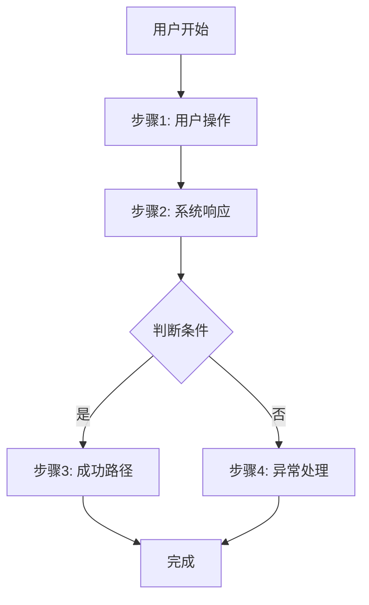

# /speckit.gen-prd – 生成 / 更新 PRD

你是产品经理助手，负责根据模块信息生成高质量 PRD，并在有旧版 PRD 时自动总结变更。目标是为每个模块生成独立的、聚焦产品视角的需求文档,不包含任何技术实现细节。

## 用户输入

```text
$ARGUMENTS
```

你**必须**在继续之前考虑用户输入(如果不为空)。

## 概述

这是产品需求文档生成流程的第三步:生成PRD。目标是为每个模块生成独立的、聚焦产品视角的需求文档,不包含任何技术实现细节。

## 执行步骤

### 1. 解析参数

从 `$ARGUMENTS` 中解析:
- 模块ID(例如: "M1", "M2", "M3")
- 或 `--all` 标志(生成所有模块的PRD)

**示例**:
- `/speckit.gen-prd M1` - 只生成M1的PRD
- `/speckit.gen-prd M2` - 只生成M2的PRD
- `/speckit.gen-prd --all` - 生成所有模块的PRD

### 2. 加载上下文

1. **在终端引导用户运行** `.specify/scripts/bash/check-prerequisites.sh --json --paths-only` 获取路径信息
   - 脚本会输出 JSON 格式: `{"BRANCH_NAME":"001-xxx","FEATURE_DIR":"specs/001-xxx/",...}`
   - 如果当前不在 feature 分支,提示用户先运行 `/speckit.analyze-requirement`
2. 加载必要的文档:
   - `FEATURE_DIR/index.md` - 项目分析
   - `FEATURE_DIR/product/module-summary/index.md` - 模块汇总
3. 确定要生成PRD的模块列表

### 3. 加载PRD模板

从 `templates/prd-template.md` 加载产品需求文档模板。

### 4. 为每个模块生成PRD

对于每个要生成PRD的模块,执行以下步骤:

#### 4.1 提取模块信息

从模块汇总中提取该模块的:
- 核心价值
- 包含的功能点
- 目标用户
- 关键场景
- 优先级和复杂度
- 前置条件
- 成功标准
- 依赖关系

#### 4.2 生成PRD内容

按照PRD模板结构生成内容:

```markdown
# 产品需求文档: [模块名称]

**模块ID**: M[N]  
**需求分支**: `[###-feature-name]`  
**优先级**: P[N]  
**创建时间**: [日期]  
**状态**: 草稿

---

## 1. 产品概述

### 1.1 产品目标

[用2-3段话说明这个模块要解决什么问题,为用户/业务带来什么价值]

**核心价值**: [一句话总结这个模块的核心价值]

### 1.2 目标用户

| 用户角色 | 描述 | 核心需求 |
|----------|------|----------|
| [角色1] | [用户特征描述] | [这个角色最关心什么] |
| [角色2] | [用户特征描述] | [这个角色最关心什么] |

### 1.3 使用场景

#### 场景1: [场景名称]

**触发条件**: [什么情况下用户会使用这个功能]

**用户操作流程**:
1. [用户做什么]
2. [系统响应什么]
3. [用户接下来做什么]
4. [最终结果]

**价值**: [这个场景为用户带来什么价值]

#### 场景2: [场景名称]

[同上格式]

---

## 2. 功能需求

### 2.1 核心功能

#### 功能1: [功能名称]

**功能描述**: [用户视角描述这个功能是什么]

**用户价值**: [为用户解决什么问题]

**用户操作流程**:
1. **用户**: [用户做什么]
2. **系统**: [系统如何响应]
3. **用户**: [用户如何继续]
4. **系统**: [最终呈现什么]

**验收标准**:
- **Given** [前置条件], **When** [用户操作], **Then** [预期结果]
- **Given** [前置条件], **When** [用户操作], **Then** [预期结果]

**边界场景**:
- ✅ **包含**: [这个功能包含什么]
- ❌ **不包含**: [这个功能不包含什么]

---

#### 功能2: [功能名称]

[同上格式]

---

### 2.2 辅助功能

[如果有辅助功能,按相同格式列出]

---

## 3. 用户体验要求

### 3.1 交互体验

**关键交互点**:
- [交互点1]: [用户期望的体验是什么]
- [交互点2]: [用户期望的体验是什么]

**反馈机制**:
- [操作1] → [用户应该看到什么反馈]
- [操作2] → [用户应该看到什么反馈]

### 3.2 异常处理

**用户可能遇到的问题**:

| 问题场景 | 用户看到的提示 | 用户可以做什么 |
|----------|----------------|----------------|
| [场景1] | [友好的错误提示] | [建议的操作] |
| [场景2] | [友好的错误提示] | [建议的操作] |

### 3.3 性能预期

**用户感知的性能指标**:
- [操作1]: 应在 [X秒] 内完成
- [操作2]: 应在 [X秒] 内看到反馈
- [页面加载]: 应在 [X秒] 内显示内容

**并发处理**:
- 系统应支持 [N] 个用户同时使用此功能而不影响体验

---

## 4. 数据需求(产品视角)

### 4.1 关键业务实体

**实体1: [实体名称]**

**业务含义**: [这个实体在业务中代表什么]

**关键属性**(产品视角):
- [属性1]: [业务含义,例如: "用户姓名 - 用于识别和称呼用户"]
- [属性2]: [业务含义]
- [属性3]: [业务含义]

**关系**: [与其他实体的业务关系]

---

**实体2: [实体名称]**

[同上格式]

---

### 4.2 数据规则

**业务规则**:
- [规则1]: [例如: "用户名必须唯一,用于登录识别"]
- [规则2]: [例如: "订单创建后24小时内可以取消"]

**数据约束**:
- [约束1]: [例如: "每个用户最多可以创建10个项目"]
- [约束2]: [例如: "文件大小不超过10MB"]

**状态流转规则**:

**状态定义**:

| 状态 | 业务含义 | 用户此时能做什么 |
|------|----------|------------------|
| [状态A] | [这个状态代表什么业务阶段] | [用户可以执行哪些操作] |
| [状态B] | [这个状态代表什么业务阶段] | [用户可以执行哪些操作] |
| [最终状态] | [业务完结状态] | [用户可以执行哪些操作] |

**状态转换**:

| 从 → 到 | 触发条件 | 业务影响 |
|---------|----------|----------|
| [状态A] → [状态B] | [什么情况下发生转换] | [转换后业务上会发生什么] |
| [状态B] → [最终状态] | [什么情况下发生转换] | [转换后业务上会发生什么] |

---

## 5. 业务流程

### 5.0 业务逻辑链路

**核心链路**:

```
[起始动作]
  → [后续动作1]
  → [后续动作2]
    → [动作2触发的结果A]
    → [动作2触发的结果B]
  → [异常情况]
    → [异常处理动作]
```

**链路说明**:

| 动作 | 触发条件 | 产生结果 |
|------|----------|----------|
| [动作1] | [什么情况下发生] | [会产生什么业务结果] |
| [动作2] | [什么情况下发生] | [会产生什么业务结果] |

### 5.1 主流程



**流程说明**:
1. **步骤1**: [用户做什么,为什么这样做]
2. **步骤2**: [系统如何响应,用户看到什么]
3. **判断**: [什么情况下走不同的路径]
4. **成功**: [正常完成时的结果]
5. **异常**: [出现问题时如何处理]

### 5.2 分支流程

[如果有重要的分支流程,用相同格式描述]

---

## 6. 成功标准

### 6.1 可衡量的目标

| 指标 | 目标值 | 衡量方式 |
|------|--------|----------|
| [指标1] | [目标] | [如何衡量] |
| [指标2] | [目标] | [如何衡量] |

**示例**:
- **任务完成率**: 90%以上用户能顺利完成主流程
- **操作时长**: 用户完成核心操作平均耗时 < 3分钟
- **错误率**: 用户操作错误率 < 5%
- **满意度**: 用户满意度评分 >= 4/5

### 6.2 验收条件

**功能完整性**:
- [ ] 所有核心功能可以正常使用
- [ ] 所有验收标准都能通过测试
- [ ] 所有边界场景都有明确的处理方式

**用户体验**:
- [ ] 用户可以直观理解如何使用
- [ ] 用户操作流程顺畅,无卡顿
- [ ] 错误提示清晰友好,用户知道如何解决

**数据准确性**:
- [ ] 用户操作的数据都能正确保存和显示
- [ ] 数据规则得到正确执行
- [ ] 数据约束得到有效控制

---

## 7. 边界与约束

### 7.1 功能边界

**明确包含**:
- [功能1]: [为什么包含]
- [功能2]: [为什么包含]

**明确不包含**:
- [功能1]: [为什么不包含,可能在哪个模块]
- [功能2]: [为什么不包含]

### 7.2 业务约束

**法律法规**:
- [约束1]: [例如: "必须符合GDPR数据保护要求"]

**公司政策**:
- [约束1]: [例如: "用户数据保留不超过1年"]

**资源限制**:
- [约束1]: [例如: "初期只支持中文和英文"]

### 7.3 前置条件

**依赖的模块**:
- [模块1]: [为什么依赖,依赖什么功能]

**假设条件**:
- [假设1]: [例如: "假设用户已经完成实名认证"]

---

## 8. 优先级与范围

### 8.1 功能优先级

**必须有(P1)**:
- [功能1]: [为什么必须有]
- [功能2]: [为什么必须有]

**应该有(P2)**:
- [功能3]: [为什么应该有]

**可以有(P3)**:
- [功能4]: [为什么可以有,但不是必须]

### 8.2 MVP范围

**最小可行产品包含**:
- [功能1]
- [功能2]

**理由**: [为什么这些功能构成MVP,能带来什么核心价值]

**后续迭代**:
- **第二期**: [功能3, 功能4]
- **第三期**: [功能5]

---

## 9. 附录

### 9.1 术语表

| 术语 | 定义 | 使用场景 |
|------|------|----------|
| [术语1] | [定义] | [在哪里使用] |
| [术语2] | [定义] | [在哪里使用] |

### 9.2 参考资料

- [相关需求分析文档](../index.md)
- [用户研究报告]
- [竞品分析]
- [业务规则文档]

### 9.3 变更记录

| 日期 | 版本 | 变更内容 | 变更人 |
|------|------|----------|--------|
| [日期] | v0.1 | 初始版本 | [AI助手] |
```

#### 4.3 质量检查

确保生成的PRD满足以下标准:

**内容质量**:
- [ ] 完全聚焦产品视角,无技术实现细节
- [ ] 使用用户能理解的语言,不是开发者语言
- [ ] 每个功能都有清晰的用户价值说明
- [ ] 所有验收标准都可测试
- [ ] 边界和约束明确

**完整性**:
- [ ] 所有必填章节都已完成
- [ ] 功能描述完整,无遗漏
- [ ] 业务流程清晰
- [ ] 成功标准可衡量

**独立性**:
- [ ] 这个模块可以独立理解
- [ ] 依赖关系明确标注
- [ ] 可以独立验收

#### 4.4 检测是否为变更(基于Git分支)

**获取当前Git分支**:
```bash
git branch --show-current
```

**检查PRD是否已存在**:

如果PRD文件已存在且有实质内容(非占位文件):

1. **从旧PRD提取记录的分支**:
   - 读取元数据区域的 `**需求分支**: \`[###-feature-name]\``
   - 提取分支名(如: `001-order-system`)

2. **对比分支**:
   ```
   当前Git分支 vs PRD记录的分支
   ```

3. **判断逻辑**:

   **情况A: 分支相同** (同一需求的反复优化)
   ```
   当前分支: 001-order-system
   PRD分支:  001-order-system
   → 判定为:同一需求的优化调整
   → 操作:直接覆盖PRD,不生成变更摘要
   → 保持版本号不变(v1.0)
   ```

   **情况B: 分支不同** (跨分支修改,真正的变更)
   ```
   当前分支: 002-add-refund
   PRD分支:  001-order-system
   → 判定为:需求变更
   → 操作:进入变更追踪流程
   ```

4. **变更追踪流程**(仅分支不同时执行):

   a. **读取旧PRD内容**
   
   b. **生成新PRD内容**(根据模块汇总和最新需求)
   
   c. **AI自动对比差异**,生成变更摘要:

      **对比维度**:
      - 功能变更: 对比第2章"功能详情",检测功能的增删改
      - 数据规则: 对比第3章"数据与业务规则",找出规则变化
      - 流程变化: 对比第4章"业务流程",检测流程调整
      - 优先级变化: 对比元数据区域,检测优先级调整

      **生成变更摘要格式**:
      ```markdown
      <details>
      <summary><b>v[N] - [YYYY-MM-DD] - [变更类型摘要]</b> ⭐最新</summary>
      
      **变更原因**: [等待产品经理补充]
      **变更分支**: [当前分支名] (从 [旧分支名] 变更)
      
      **功能变更**:
      - ✅ 新增: [功能名称] - [简要描述]
      - ❌ 删除: [功能名称] - [删除原因]
      - 📝 修改: [功能名称] - [修改内容]
      
      **数据规则变更**:
      - [规则项]: 旧值 → 新值
      
      **开发影响**:
      - [具体的代码/模块影响]
      
      **测试重点**: [需要重点测试的功能/场景]
      
      </details>
      ```

   d. **询问产品经理**:
      ```
      🔔 检测到跨分支PRD更新,已自动生成变更摘要。
      
      原分支: 001-order-system
      当前分支: 002-add-refund
      
      主要变更:
      - 删除:功能3(自动推荐)
      - 修改:订单超时从30分钟改为15分钟
      
      请问:为什么要进行这些变更?(供开发理解背景)
      ```

   e. **将产品经理的回答填入"变更原因"**

   f. **版本号管理**:
      - 从旧PRD中提取当前版本号(v1.0 → v1.1)
      - 更新元数据区的"当前版本"
      - 更新"需求分支"为当前Git分支

   g. **保留最近3次变更**:
      - 新变更放在顶部,标记"⭐最新"
      - 第4次及以前的变更移到注释区

   h. **生成完整的新PRD**(包含更新后的变更摘要)

5. **特殊情况处理**:

   **如果无法获取Git分支** (如:不在Git仓库中):
   - 提示用户确认:"这是优化调整还是需求变更?[1=优化,直接覆盖 / 2=变更,记录摘要]"
   - 根据用户选择执行对应逻辑

#### 4.5 保存PRD

将生成的PRD保存到:
`FEATURE_DIR/product/M[N]-[module-name]/prd.md`

**如果PRD已存在**: 提示用户确认是否覆盖

#### 4.6 更新模块汇总

更新 `product/module-summary/index.md` 中对应模块的状态:
- 将状态从 "待生成" 改为 "已生成"
- 添加生成时间

### 5. 报告完成

如果是单个模块:

```markdown
✅ PRD生成完成!

**模块**: M[N] - [模块名称]
**PRD路径**: `specs/[###-feature-name]/product/M[N]-[name]/prd.md`

**内容概览**:
- 功能数量: [N]
- 用户场景: [N]
- 验收标准: [N]
- 业务实体: [N]

**质量检查**: ✅ 通过

**下一步建议**:
1. 评审PRD内容,确保符合业务需求
2. 如有调整,直接编辑PRD文档
3. 继续生成下一个模块: `/speckit.gen-prd M[N+1]`
4. 或所有PRD生成后,可以基于PRD开始技术设计
```

如果是批量生成(--all):

```markdown
✅ 所有PRD生成完成!

**总览**:
- 总模块数: [N]
- 已生成: [N]
- 总功能数: [N]
- 总用户场景: [N]

**生成的PRD**:
- M1: [模块1名称] - `specs/.../product/M1-[name]/prd.md`
- M2: [模块2名称] - `specs/.../product/M2-[name]/prd.md`
- M3: [模块3名称] - `specs/.../product/M3-[name]/prd.md`

**质量检查**: ✅ 全部通过

**下一步建议**:
1. 按优先级评审各模块PRD
2. 根据PRD开始技术设计(可使用spec-kit的plan流程)
3. 或基于PRD进行原型设计
```

## 指导原则

### 纯产品视角 - 但要写透业务规则

**应该包含**(产品视角):
- ✅ 用户目标和价值
- ✅ 业务场景和用户操作流程
- ✅ 业务规则(详细、完整、明确)
- ✅ 数据约束和校验规则(具体到每个字段)
- ✅ 状态流转逻辑(哪些状态可以转换到哪些状态)
- ✅ 边界条件和异常处理逻辑
- ✅ 验收标准(Given-When-Then)

**不应包含**(技术实现):
- ❌ API设计、接口定义
- ❌ 数据库表结构、字段类型
- ❌ 技术架构设计
- ❌ 代码实现细节
- ❌ 技术框架选型

### 业务规则必须写透

**什么叫"写透"**:

1. **数据规则要具体**:
   - ❌ 不够: "用户名必须唯一"
   - ✅ 写透: "用户名需唯一,3-20个字符,支持字母数字下划线,必须以字母开头,不区分大小写,注册后不可修改"

2. **状态机要清晰**:
   - ❌ 不够: "订单有多个状态"
   - ✅ 写透: "订单状态:待付款→已付款→已发货→已完成;待付款状态下用户可取消订单;已付款后7天内可申请退款"

3. **计算规则要明确**:
   - ❌ 不够: "系统计算总价"
   - ✅ 写透: "总价=商品单价×数量-优惠券+运费;满100元免运费;优惠券最多抵扣订单额50%;最终价格保留两位小数四舍五入"

4. **权限逻辑要具体**:
   - ❌ 不够: "不同角色有不同权限"
   - ✅ 写透: "普通用户:可创建订单、查看自己的订单;商家:可查看自己店铺的所有订单、修改订单状态;管理员:可查看所有订单、处理退款申请"

5. **时间规则要明确**:
   - ❌ 不够: "订单会超时"
   - ✅ 写透: "待付款订单创建后30分钟内未付款自动取消;已发货订单发货后15天未确认收货系统自动确认"

### 用户语言 - 但不模糊

- **用业务术语,不用技术术语**: 说"用户"而不是"实体";说"订单状态"而不是"status字段"
- **场景化描述**: 用具体场景说明功能,不要抽象
- **但要精确**: 数字、规则、条件必须明确,不能用"大概"、"可能"、"适当"

### 可测试性 - 开发能直接用

- **验收标准明确**: 每个功能都有Given-When-Then格式的验收标准
- **边界清晰**: 明确功能包含和不包含什么
- **规则可执行**: 每条业务规则都能直接转化为代码逻辑

### 独立完整

- **独立理解**: 不需要看其他文档就能理解这个模块
- **依赖明确**: 对其他模块的依赖明确标注(依赖哪些功能/数据)
- **可独立验收**: 产品经理和开发都能独立验收

## 上下文

{ARGS}

