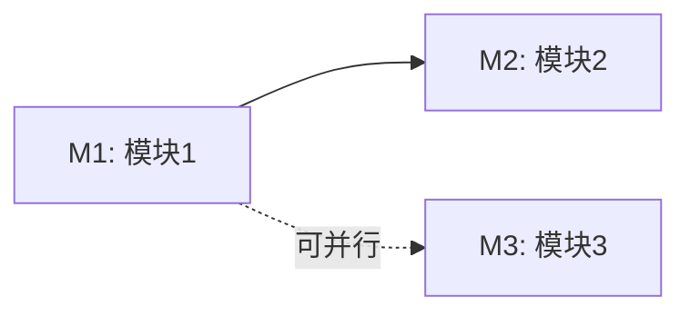
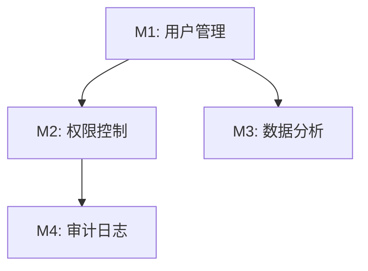

# /speckit.split-modules – 模块拆分

你是产品经理助手，负责基于「需求分析」文档按业务价值拆分模块。目标是将需求分析的结果转化为独立的功能模块,为下一步生成独立的产品需求文档做准备。

## 用户输入

```text
$ARGUMENTS
```

你**必须**在继续之前考虑用户输入(如果不为空)。

## 概述

这是产品需求文档生成流程的第二步:模块拆分。目标是将需求分析的结果转化为独立的功能模块,为下一步生成独立的产品需求文档做准备。

## 执行步骤

### 1. 加载需求分析文档

1. **在终端引导用户运行** `.specify/scripts/bash/check-prerequisites.sh --json --paths-only` 获取路径信息
   - 脚本会输出 JSON 格式: `{"BRANCH_NAME":"001-xxx","FEATURE_DIR":"specs/001-xxx/",...}`
   - 如果当前不在 feature 分支，提示用户先运行 `/speckit.analyze-requirement`
2. 解析JSON获取:
   - `FEATURE_DIR`: 需求目录路径
   - `FEATURE_SPEC`: 规格文档路径
3. 加载 `FEATURE_DIR/index.md` 文件
4. 如果文件不存在,提示用户先运行 `/speckit.analyze-requirement`

### 2. 提取模块划分方案

从需求分析文档中提取:
- 初步模块划分建议
- 功能点列表及其依赖关系
- 业务目标和约束
- 用户角色和场景

### 3. 确认或调整模块划分

向用户展示初步的模块划分方案:

```markdown
## 建议的模块划分方案

基于需求分析,建议将需求拆分为以下 [N] 个模块:

| 编号 | 模块名称 | 核心价值 | 优先级 | 复杂度 | 依赖模块 | 包含功能点 |
|------|----------|----------|--------|--------|----------|------------|
| M1   | [模块1]  | [价值]   | P1     | 中等   | 无       | [功能点1, 2] |
| M2   | [模块2]  | [价值]   | P2     | 简单   | M1       | [功能点3]    |
| M3   | [模块3]  | [价值]   | P1     | 复杂   | 无       | [功能点4, 5] |

**层级结构**(如有子系统/模块分组):
```
系统
├── 子系统A
│   ├── M1 - [模块1]
│   └── M2 - [模块2]
└── 子系统B
    └── M3 - [模块3]
```

**依赖关系图**:


**说明**:
- 实线箭头: 强依赖(必须先完成)
- 虚线箭头: 可并行开发

**你可以**:
- 使用命令：`/speckit.split-modules 确认生成文件` —— 表示你已确认当前模块拆分方案，并同意我**按该方案创建/更新模块目录结构**（`specs/[###-feature-name]/product/` 下的各模块目录和 `product/module-summary/index.md`）
- 或回复 "调整 [具体说明]" 并说明需要如何调整，我将继续在对话中只修改方案而不写入任何文件
- 或直接提供新的模块划分方案

**⚠️ 只要你没有通过 `/speckit.split-modules 确认生成文件` 明确发起"生成模块目录和汇总文档"的操作，我都不会创建或修改任何文件。**
```

等待用户确认或调整。

### 3.5 大模块识别与子模块拆分

**识别大模块**:
- AI根据功能复杂度、关联性、业务范围综合判断
- 向用户提示："模块 M[N] 包含 [X] 个功能点，是否需要拆分为子模块？"
- 由用户决定是否拆分

**子模块拆分**（需用户确认）:

```markdown
## 大模块拆分建议

**M2 模拟考试** 包含 9 个功能点，建议拆分：

| 子模块 | 包含功能 | 核心价值 |
|--------|----------|----------|
| M2.1 组卷管理 | [功能1, 功能2, 功能3] | 支持多种组卷方式 |
| M2.2 考试流程 | [功能4, 功能5, 功能6] | 完整的在线考试体验 |
| M2.3 成绩分析 | [功能7, 功能8, 功能9] | 多维度成绩分析 |

**是否接受此拆分？**
- 使用命令：`/speckit.split-modules 确认生成文件` —— 按子模块拆分
- 或回复 "不拆" - 保持为单一模块
- 或回复 "调整 [具体说明]" - 说明如何调整
```

**子模块目录结构**:
```
product/
└── M2-exam-system/
    ├── overview.md              # 模块总览
    ├── M2.1-question-compose/
    │   └── prd.md
    ├── M2.2-exam-flow/
    │   └── prd.md
    └── M2.3-score-analysis/
        └── prd.md
```

**子模块编号规则**: M2.1, M2.2, M2.3...

### 4. 创建模块结构

为每个确认的模块创建目录结构:

```
specs/[###-feature-name]/
├── index.md          # 项目分析(已存在)
└── product/                            # 产品文档归档文件夹
    ├── module-summary/
    │   └── index.md                    # 模块汇总
    ├── M1-[module-name]/               # 模块1
    │   └── prd.md                      # 产品需求文档
    ├── M2-[module-name]/               # 模块2
    │   └── prd.md
    └── M3-[module-name]/               # 模块3
        └── prd.md
```

### 5. 生成模块汇总文档

在 `product/module-summary/index.md` 创建模块汇总:

```markdown
# 模块汇总: [需求名称]

**需求分支**: `[###-feature-name]`  
**创建时间**: [日期]  
**总模块数**: [N]

## 模块清单

| 模块ID | 模块名称 | 核心价值 | 优先级 | 状态 | PRD文档 |
|--------|----------|----------|--------|------|---------|
| M1 | [模块1名称] | [一句话价值描述] | P1 | 待生成 | [链接](./M1-[name]/prd.md) |
| M2 | [模块2名称] | [一句话价值描述] | P2 | 待生成 | [链接](./M2-[name]/prd.md) |
| M3 | [模块3名称] | [一句话价值描述] | P1 | 待生成 | [链接](./M3-[name]/prd.md) |

## 模块依赖关系



**依赖说明**:
- **M2依赖M1**: 权限控制需要先有用户管理
- **M3依赖M1**: 数据分析需要用户数据
- **M4依赖M2**: 审计日志依赖权限系统

**提示**: 有依赖关系的模块需要按顺序开发,无依赖的可以并行

## 模块详细信息

### M1: [模块1名称]

**核心价值**: [用一句话说明这个模块为用户/业务带来的核心价值]

**包含功能点**:
- [功能点1]: [简短描述]
- [功能点2]: [简短描述]

**目标用户**: [主要用户角色]

**关键场景**: [1-2个最重要的使用场景]

**优先级**: P1  
**复杂度**: 中等  
**独立性**: 可独立开发和测试

**前置条件**: 无

**成功标准**:
- [标准1]: [可衡量的指标]
- [标准2]: [可衡量的指标]

---

### M2: [模块2名称]

[同上格式]

---

### M3: [模块3名称]

[同上格式]

---

## 下一步行动

依次为每个模块生成产品需求文档(PRD):

1. **M1**: 运行 `/speckit.gen-prd M1` 生成第一个模块的PRD
2. **M2**: 运行 `/speckit.gen-prd M2` 生成第二个模块的PRD
3. **M3**: 运行 `/speckit.gen-prd M3` 生成第三个模块的PRD

或者一次性生成所有PRD:
```
/speckit.gen-prd --all
```
```

### 6. 为每个模块创建PRD占位文件

在每个模块目录下创建 `prd.md` 占位文件:

```markdown
# 产品需求文档: [模块名称]

**模块ID**: M[N]  
**需求分支**: `[###-feature-name]`  
**优先级**: P[N]  
**状态**: 待生成

> 此文档将由 `/speckit.gen-prd M[N]` 命令生成。

## 快速预览

**核心价值**: [一句话价值描述]

**主要功能**: [功能点列表]

**目标用户**: [用户角色]
```

### 7. 质量检查

确保模块拆分满足以下标准:

- [ ] 每个模块都有独立的业务价值
- [ ] 每个模块可以独立开发和测试
- [ ] 模块数量合理(建议3-7个)
- [ ] 模块之间的依赖关系清晰
- [ ] 有明确的开发顺序建议
- [ ] 每个模块都有优先级标记
- [ ] 模块汇总文档结构完整
- [ ] 所有PRD占位文件已创建

### 8. 报告完成

报告拆分结果:

```markdown
✅ 模块拆分完成!

**总览**:
- 需求分支: [###-feature-name]
- 模块总数: [N]
- 高优先级模块(P1): [N]
- 中优先级模块(P2): [N]
- 低优先级模块(P3): [N]

**创建的文件**:
- 模块汇总: `specs/[###-feature-name]/product/module-summary/index.md`
- PRD占位文件: [N] 个

**下一步建议**:

**方式1 - 逐个生成**(推荐,适合逐步细化):
1. 生成M1的PRD: `/speckit.gen-prd M1`
2. 评审M1的PRD
3. 生成M2的PRD: `/speckit.gen-prd M2`
4. 依此类推...

**方式2 - 批量生成**(适合快速预览):
```
/speckit.gen-prd --all
```

**建议**: 按优先级顺序生成PRD,先完成高优先级模块(P1)。
```

## 指导原则

### 模块拆分的核心标准

**不要为了拆而拆,每个模块必须满足:**

1. **独立的业务价值** - 用户/业务方能直接感知到这个模块的价值
   - ✅ 好例子: "订单管理" - 用户可以创建、查看、取消订单
   - ❌ 坏例子: "数据库层" - 这是技术视角,不是业务模块

2. **完整的业务闭环** - 模块内包含完整的用户操作流程
   - ✅ 好例子: "用户注册登录" - 从注册到登录到找回密码是完整流程
   - ❌ 坏例子: "用户信息录入" - 只是流程的一部分,不完整

3. **可独立交付验收** - 产品经理可以独立验收这个模块
   - 有明确的验收标准
   - 不依赖其他未完成模块就能演示核心价值

4. **合理的开发粒度** - 考虑团队实际情况
   - 太细碎会增加协调成本
   - 太庞大会导致并行困难
   - 建议:单个模块能在合理周期内完成核心功能

### 模块拆分的判断流程

**对于每个候选模块,问自己:**

1. **业务价值问**: 如果只交付这个模块,用户能获得什么价值?
   - 如果答不上来 → 可能拆得太细或者是技术视角

2. **独立性问**: 这个模块能否独立演示给客户看?
   - 如果必须依赖其他模块才能演示 → 考虑合并

3. **复用性问**: 这个模块的功能是否会被多个场景使用?
   - 如果是基础能力(如用户管理) → 应该独立
   - 如果只服务于某个场景 → 考虑合并到业务模块

4. **团队协作问**: 拆分后能否提高并行开发效率?
   - 如果两个模块强耦合,频繁需要协调 → 考虑合并

### 优先级定义

- **P1(高)**: 核心功能,没有这个模块产品无法使用
- **P2(中)**: 重要功能,影响用户体验但不影响核心流程
- **P3(低)**: 增强功能,锦上添花

### 依赖关系原则

- **强依赖**: 必须先完成被依赖模块,通常是基础能力模块
- **弱依赖**: 可以并行开发,集成时对接接口
- **尽量减少依赖**: 每增加一个依赖就增加一个协调成本

### 常见拆分误区

❌ **按技术层拆分**: "前端模块"、"后端模块"、"数据库模块"
❌ **拆得太碎**: 10个模块但每个只有1-2个功能点
❌ **拆得太粗**: 1个模块包含了整个系统的一半功能
❌ **忽略依赖**: 拆完后发现所有模块都互相依赖
❌ **只考虑技术**: 没有考虑产品迭代和交付节奏

## 上下文

{ARGS}
